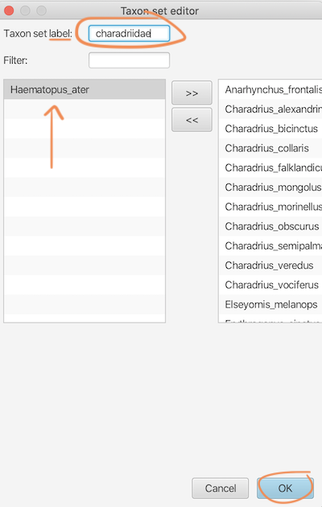
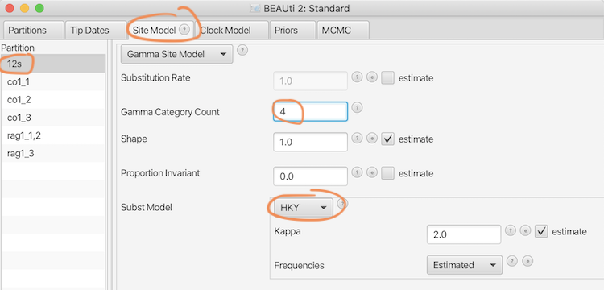
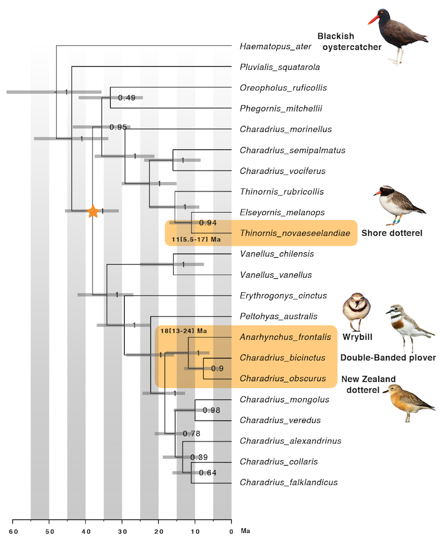

# Bayesian Phylogenetic Inference (Activity 6)

## Objective

Become familiar with BEAST 2 and Bayesian inference. So far, we have learned how to retrieve homologous sequences, how to align these sequences to match homologous sites, how to find the best-fit substitution model for our data, and how to find the phylogenetic hypothesis that best fits our data using maximum likelihood (ML) phylogenetic inference. In this tutorial, we will now use Bayesian phylogenetic inference to infer a time-calibrated phylogeny.

## Table of contents

* [Background](#software)
* [Requirements](#software)
* [6.1 Test the effect of different clock models (strict vs. relaxed clock)](#clock_models)
	* [6.1.1 Infer the Charadriidae phylogeny using the strict clock model](#co1_strict)
		* [6.1.1.1 Generate a XML configuration file in BEAUti](#beauti)
		* [6.1.1.2 Inspect the XML configuration file](#xml)
		* [6.1.1.3 Run the MCMC analysis using BEAST 2](#beast)
		* [6.1.1.4 Visually inspect the posterior estimates using Tracer](#tracer)
	* [6.1.2 Infer the Charadriidae phylogeny using the relaxed clock model](#co1_relaxed)
	* [6.1.3 Compare the results of the strict and relaxed clock analyses](#strict_vs_relaxed)
		* [6.1.3.1 Compare the log files using Tracer](#compare_tracer)
		* [6.1.3.2 Compare the tree files using TreeAnnotator and FigTree](#compare_trees)
* [Optional: Sample from the prior distribution and ignore the data](#nodata)
* [6.2 Estimate the time of arrival of the endemic New Zealand shorebirds](#dispersal_dating)

## Background

 
Background Bayesian inference (click here)

--------
**Background**: In contrast to maximum-likelihood inference, Bayesian inference can take into account prior expectations. In the context of phylogenetic inference, this means for example that base frequencies can be constrained towards values that are considered realistic. In addition, prior probabilities can be used to constrain divergence times in phylogenetic divergence-time estimation. In combination with an assumption about the molecular clock, these can then inform about the overall timeline of diversification.  

--------

 
Background about the software and data (click here)

-------- 
**Software**: Here we use the Bayesian software package BEAST2 ([Bouckaert et al. 2014](https://doi.org/10.1371/journal.pcbi.1003537)) to infer a time-calibrated phylogeny. The package contains several programs: The settings for the analysis will be specified with the program BEAUti, a program with a graphical user interface (GUI) generating XML configuration files. The Bayesian analysis itself is going to be conducted with BEAST 2, and a summary tree will be generated with the program TreeAnnotator. In addition, we will use of the program Tracer ([Rambaut et al. 2018](https://doi.org/10.1093/sysbio/syy032)) to assess stationarity of the Bayesian analysis.  

**Data**: You will use the exact same genes, sequences, and species as in the previous analyses. However, BEAST 2 requires all alignments to contain the same species (and there were some sequences of species missing in the 12s alignment) as well as that the species have exactly the same names (so far, they differed by the accession numbers). Therefore, these adjustments were made to the three alignment files: [`12s.nex`](data/12s.nex), [`co1.nex`](data/co1.nex), [`rag1.nex`](data/rag1.nex). 

--------

  

## Requirements

For the software packages used in this activity, no online tools exist and they therefore need to be installed locally. 

* **BEAST 2** – Go to the [BEAST 2 website](http://www.beast2.org/) and **download** the current BEAST 2 package (v2.7.1) according to your platform. The BEAST 2 package includes BEAUti, BEAST 2 itself, TreeAnnotator, and other tools. As all these programs are written in Java, compilation is not required, and they should work on Mac OS X, Linux, and Windows.

* **Tracer** – Download [Tracer](https://github.com/beast-dev/tracer/releases) according to your platform ([Mac OS X](https://github.com/beast-dev/tracer/releases/download/v1.7.2/Tracer.v1.7.2.dmg), [Linux](https://github.com/beast-dev/tracer/releases/download/v1.7.2/Tracer_v1.7.2.tgz), or [Windows](https://github.com/beast-dev/tracer/releases/download/v1.7.2/Tracer.v1.7.2.zip)) Just like BEAST 2, Tracer is written in Java and should work on any system.

* **FigTree** To visualize and edit the tree, we will again use the program [FigTree](https://github.com/rambaut/figtree/releases/tag/v1.4.4). You should already have this software installed from the Maximum Likelihood tutorial. If not, download FigTree for [Mac OS X](https://github.com/rambaut/figtree/releases/download/v1.4.4/FigTree.v1.4.4.dmg), [Linux](https://github.com/rambaut/figtree/releases/download/v1.4.4/FigTree_v1.4.4.tgz), or [Windows](https://github.com/rambaut/figtree/releases/download/v1.4.4/FigTree.v1.4.4.zip).

## 6.1 Test the effect of different clock models (strict vs. relaxed clock)

A strict clock model assumes that every branch in a phylogenetic tree evolves according to the same evolutionary rate, while the uncorrelated relaxed clock allows each branch to have its own evolutionary rate.

### 6.1.1 Infer the Charadriidae phylogeny using the strict clock model

#### 6.1.1.1 Generate a XML configuration file in BEAUti

Download the file [`co1.nex`](data/co1.nex). Open the program BEAUti (“Bayesian Evolutionary Analysis Utility”), and click “**Import Alignment**” in BEAUti’s “**File**” menu. Select the co1 alignment file that you just downloaded (if you get the error "unsupported sequence file", close BEAUti, re-open, and try again.

<kbd></kbd>

The BEAUti interface has six tabs named “Partitions”, “Tip Dates”, “Site Model”, “Clock Model”, “Priors”, and “MCMC”. The first of these (“**Partitions**”) should currently be selected. The “Tip Dates” tab is not important for us, So, skip the “Tip Dates” tab and progress to the “Site Model” tab.

 
But, what are "Tip Dates" for? (click here)

--------
They can be used to specify the times at which samples were taken, which allows time-calibration of viral phylogenies. But compared to the time scales over which our sequences have diverged, the small difference in sampling times (a few years) is completely negligible. 

--------

 

In the “**Site Model**” tab you can select models for substitution rates and state frequencies, such as the Jukes-Cantor model, the HKY model or the GTR model. By default, the **Jukes-Cantor (JC69)** model is selected, which is ok for now. 

<kbd></kbd>

Proceed to the “**Clock Model**” tab. You’ll see that a “**Strict Clock**” model is selected by default. That’s what we’ll use for now. At the right of this window, you’ll see a checkbox for “**estimate**” that is currently not activated. This is because we have not specified age constraints yet, and without any age constraints, the analysis relies on a fixed rate for the molecular clock. The checkbox will automatically become activated once we specify age constraints.

<kbd></kbd>

Click on the “**Priors**” tab. Here, prior probability distributions can be specified for all model parameters. Because we have so far selected the simple Jukes-Cantor model, not many parameters are listed. You’ll see two rows, one row for the type of the diversification model (**Tree.t**) where currently the “Yule Model” (the Yule process) is selected, and one row for the specified prior probability for the only parameter of this model, the “**birthRate**” parameter (*i.e.*, the speciation rate).

Click on the drop-down menu that currently says “**Yule Model**”. Select the “**Birth Death Model**” instead to assume speciation as well as extinction. You’ll see that an additional row has been added. The second row now is for the “**BDBirthRate**” and the third is for the **“BDDeathRate**”, both rates are estimated during the analysis. 

 
Background: BDDeathRate and BDBirthRate and their prior constraints (click here)

--------

In BEAST 2, the BDBirthRate and the BDDeathRate do not correspond to the speciation ( $λ$ ) and extinction ( $μ$ ) rates directly. Instead, the “BDBirthRate” is the so-called “net diversification rate” which is the difference between the speciation rate and the extinction rate ( $λ-μ$ ), and the “BDDeathRate” is the “relative extinction rate, the ratio between extinction and speciation ( $μ/λ$ ).
Click on the **triangle** next to "**BDDeathRate**" to see the prior constrains. The relative extinction rate is typically constrained to lie between 0 and 1, because if it was greater than 1, this would mean that the extinction rate is greater than the speciation rate, and in such a case, clades would go extinct rather than diversify.
Also click on the **triangle** next to **BDBirthRate**. This rate has an entirely uninformative uniform probability distribution with a lower limit of 0 and an unrealistically high upper limit of 10,000. The unit for this is “net diversification per branch per million years” meaning that the upper limit could only be reached if we had a phylogeny in which several ten thousands of species would have evolved each million years. Clearly this is not the case. Nevertheless, for now we leave the uninformative prior probability as it is. 

--------

 

Now, click on the “**+ Add Prior**” button below the two rows. This will allow the specification of clades (called “taxon sets” by BEAST 2) that can then be constrained to be monophyletic and/or to be of a certain age (MCRA prior, which stands for “most recent common ancestor”). Select the “**MCRA prior**”. 

<kbd></kbd>

A pop-up window will appear, in which you can select a name for a clade as well as species to be included in the clade. In the top field of the pop-up window, specify “**all**” as the “**Taxon Set label**”. Leave the “Filter” field empty. In the field at the bottom left of the pop-up window **select all the species** (command-A) and click the “**>>**” button to move them into the ingroup of the clade, the window to the right. Then, click “**OK**”. We have now defined a clade that contains all species. We did so because this now allows us to constrain the age of the root of the phylogeny. 

<kbd></kbd>

To constrain the phylogeny’s root age, click the **[none] drop-down menu** in the fourth row, to the right of the button that should now say “all.prior”. You will see a list of distribution types. Of these, click on “**Log Normal**” to select a log-normally-distributed prior probability distribution for the age of the root of the phylogeny.

To specify the parameters of the log normal distribution for the prior probability, click the **black triangle** at the left of the fourth row, left of the button saying “all.prior”. A new part of the window should open with three parameter fields for “**M**” **(mean)**, “**S**” **(Sigma)**, and “**Offset**”. The sigma parameter is the standard deviation of the log-normal distribution, the offset defines the minimum of the distribution, which is usually 0. Choose 50.0 for the mean, 0.01 for the standard deviation, and leave the offset at 0. With this we placed a narrow constraint on the age of the root of the phylogeny, we pretend to know the species in our phylogeny began to diversify 50 +/- 1 million years ago. This is of course overly confident, and we will perform a more realistic and substantiated time calibration later. Tick the box for “**Mean in real space**”. In the window to the right, you should now see that the distribution is centered around 50, with a 2.5% quantile at 49 and a 97.5% quantile at 51 (if you do not see the distribution, re-enter the 0.01 for the standard deviation). Click on the black triangle again to close this part of the window. 

<kbd></kbd>

Click on “**+ Add Prior**” again to add another “**MCRA prior**", and specify a clade named “**charadriidae**” that includes all species except for *Haematopus ater*. 

<kbd></kbd>

This clade should not be constrained with an age but instead to be monophyletic, so check the “**monophyletic**” box on the very right of this prior. 

<kbd></kbd>

The reason why we do this is two-fold: First the addition of monophyly constraints facilitates the MCMC search since it reduces the “tree space” to be explored, meaning that some phylogenies (those in which the clades do not appear as monophyletic) do not need to be tested at all. Second, with this we constrain our in-group, so we define our outgroup species to actually be the outgroup.

Finally, click on the last tab named “**MCMC**”. Here, set the “**Chain Length**” to 2,000,000 steps of the MCMC chain, and leave the other fields for “Store Every”, “Pre Burnin”, and “Num Initialization Attempts” as they are. 

<kbd></kbd>

Click on the triangle to the left of “**tracelog**”, where you can specify the name of the log file written by BEAST 2 and specify `co1_strict_clock.log` as the name.
Also click on the triangle to the left of “**treelog**”, and specify the same file name, except that the ending should be `.trees` instead of `.log`. 
Then, click on “**Save As**” in BEAUti’s “**File**” menu to save the file. Name it `co1_strict_clock.xml`.

#### 6.1.1.2 Inspect the XML configuration file

Open the generated XML file [`co1_strict_clock.xml`](res/co1_strict_clock.xml) in a text editor to see how BEAST 2 has translated your specifications into the XML input format for BEAST 2. 

 
 Background: Explanations on the XML content (click here)

--------
You will see the sequence alignment with tag “**sequence**” near the top of the file, followed by some specifications for “**maps**”; these are short names used by BEAST 2 for distribution classes. Around line 51, you’ll see an element starting with “**run**”, where the length of the MCMC chain is specified.
Parameters that are estimated during the analysis are initiated between the “**state**” elements on the next lines. This is followed by the phylogeny parameter, specified between the “**init**” tags. Just below that, the "**distribution**" tag begins, including the elements “**posterior**” and “**prior**”. Here you’ll find the clade definitions for the clades “all” and “charadriidae”. Below these, around line 135, you should see the “**likelihood**” element which includes the site model. You can see that the parameters for “**mutationRate**”, “**gammaShape**”, and “**proportionInvariant**” are all fixed (estimate=“false”). 
The rest of the XML file (after around line 147) includes the "**operators**", these are the methods with which the model parameters are modified during the MCMC search to propose new states (the step or scale operators). Finally, the “**logger**” elements define which output should be written to the log files with endings “.log” and “.trees”, and to the screen. 

--------

#### 6.1.1.3 Run the MCMC analysis using BEAST 2

Open the software BEAST 2 and click on “**Choose File...**” to select the XML input file [`co1_strict_clock.xml`](res/co1_strict_clock.xml). Leave everything else at their default values and click “**Run**” to start the analysis. This should take no more than 5 minutes.  
 
Note on thread/CPU usage: You may choose one or two thread, depending on your computer. However, with a single partition, BEAST 2 can only use a single thread for the calculation of the likelihood. You can calculate the time your run will take by checking the minutes/Msamples output in the log file.

 
 Issue closing the BEAST 2 App on Mac OS X (click here)

--------
If you experience difficulties quitting the BEAST 2 App on Mac OS X, either "Force quit" BEAST 2 via the Activity Monitor or execute BEAST 2 via the Terminal using the command `/Applications/BEAST_2.7.1/bin/beast -threads 2 co1_strict_clock.xml`

--------

<kbd></kbd>

#### 6.1.1.4 Visually inspect the posterior estimates using Tracer

If you don’t have the software Tracer yet, download and install [Tracer](https://github.com/beast-dev/tracer/releases) according to your platform ([Mac OS X](https://github.com/beast-dev/tracer/releases/download/v1.7.2/Tracer.v1.7.2.dmg), [Linux](https://github.com/beast-dev/tracer/releases/download/v1.7.2/Tracer_v1.7.2.tgz), or [Windows](https://github.com/beast-dev/tracer/releases/download/v1.7.2/Tracer.v1.7.2.zip)). Once the BEAST 2 analysis has finished, open the file with the ending [`.log`](res/co1_strict_clock.log) with Tracer by simply dragging the file to the “**Trace files**” panel, by using the “**+**” button in the same window, or choosing “**File**” > “**Import Trace file**” from the menu. You should now see a window with four parts: 

**Trace files** in the top left corner, lists the loaded log files – currently this is just a single file. This part of the window also specifies the number of states found in this file and the burn-in. 

	
 Background: burn-in (click here)

--------
The burn-in is the number of states that are removed from the beginning of the MCMC chain to account for the initial period during which the MCMC chain may not have found the optimal region of the parameter space yet. In the MCMC trace (see below), this period is visible by fluctuating low probabilities that slowly rise to find their equilibrium distribution. In contrast, it is assumed that during the post-burnin period (the stationary phase), samples are taken according to the true underlying posterior probability distribution. The number of samples to discard as burn-in may depend on dataset size, model complexity, and chain length. As a rule of thumb, at least the first 10% of the chain should be discarded.

--------

**Traces** in the bottom left part of the Tracer window, lists statistics for the estimates of the posterior probability, the likelihood, and the prior, as well as for the parameter values estimated during the analysis. 
The second column in this part shows the mean estimates for each parameter and the third the “ESS” value. The latter is the so-called “effective sample size” which is a measure of convergence of the MCMC. If these values are below 200, the parameter estimates can in principle not be considered reliable, and the MCMC search should be extended.

**Summary statistics** in the top right part of the Tracer window presents more detailed statistics for the parameter currently selected in the bottom left part of the window.

**A graph of MCMC samples** is shown in the bottom right. By default these are shown in the form of a histogram, but when you click on the tab for “**Trace**” (at the very top right), you will see how the states of these samples have changed over the course of the MCMC. If this plot has the form of a “hairy caterpillar” that lies horizontally, the parameter estimates can be considered stationary.

<kbd></kbd>

 In the “**Traces**” panel, click on the parameter “**TreeHeight**”. This is the posterior estimate for the length of the tree from the root to the tips, which is equivalent to the age of the root. We set a prior on this age that specified the age to have a mean of 50 with a standard deviation of +/- 0.01. Have a look at the summary statistics, what are the values for mean and the 95% HPD (“highest posterior density”) interval? 

	
 Answer (click here)

--------
The “TreeHeight” is almost exactly 50 with a HPD between about 49 and 51, just as we specified it to be.

<kbd></kbd>

--------

## 6.1.2 Infer the Charadriidae phylogeny using the relaxed clock model

If you have BEAUti still open, you can continue editing. Otherwise, re-open the previous XML [`co1_strict_clock.xml`](res/co1_strict_clock.xml) in BEAUti by clicking on "**File**" and then "**Load**" in the menu bar. 

Go directly to the “**Clock Model**” tab, and change the model from “Strict Clock” to “**Optimised Relaxed Clock (ORC)**”. 

	
 Background: ORC (click here)

--------
The ORC ([Douglas et al., 2021](https://doi.org/10.1371/journal.pbio.0040088)) is a recent implementation of the relaxed clock model with optimized operators that improve the efficiency of the MCMC chain compared to the earlier uncorrelated log-normal clock of [Drummond et al. (2006)](https://doi.org/10.1371/journal.pbio.0040088). 

--------

In the “**Prior**” tab, you now have three new priors, "**ORCRates**", the log-normal prior distribution for the rates of the relaxed clock, “**ORCsigma**”, the standard deviation of this log-normal prior distribution, and “**ORCucldMean**”, a multiplication factor for all relaxed clock rates. Don't change anything here, but ...

 ... what would happen, if we would set the standard deviation to zero?

	
 Answer (click here)

--------
If the standard deviation would be zero, there would be no variation in rates among branches, meaning that the model would be identical to a strict clock. 

--------

Finally, go to the the “**MCMC**” tab, and change the name of the log file to `co1_relaxed_clock.log` and of the tree file to `co1_relaxed_clock.trees`. Save the XML file under the name `co1_relaxed_clock.xml` by clicking “**Save As**” from the “**File**” menu. 

As before, use BEAST 2 to run an analysis, but now use the XML file [`co1_relaxed_clock.xml`](./res/co1_relaxed_clock.xml) as input. You may choose one or two thread depending on your computer, but just leave everything else at their default values and click “**Run**” to start the analysis. This should take no more than 10 minutes.

## 6.1.3. Compare the results of the strict and relaxed clock analyses

### 6.1.3.1 Compare the log files using Tracer

Once the analysis has finished, open the log file [`co1_relaxed_clock.log`](./res/co1_relaxed_clock.log) in Tracer, with the log of the strict clock model still open. 

 Look at the "Trace" tab and the ESS values, do you consider the analysis as converged?

	
 Answer (click here)

--------
Check the “Trace” of the posterior for convergence. Does it look like a hairy caterpillar? Are all ESS (effective sample size) values above 200? 

Although usually an ESS larger than 200 indicates stationarity or convergence (in case of several replicates), this is only a reference value and higher ESS values may be required for reliable convergence or lower ESS values can be considered sufficient. In Tracer, ESS values below 100 are colored in red (don't trust the results), and ESS values between 100 and 200 are colored in yellow (trust only based on individual inspection). If many ESS values are below 200, likely the chain has simply not run long enough.

--------

In the "**Trace File tab**", select both trace files. You will see summary statistics and graphs for both analyses. In the bottom-left part of the window, have a look at the ”**posterior**” and “**likelihood**”. 

 Which of the two models appears to be better? And why can we not interpret the result like that?

	
 Answer (click here)

--------
The posterior and the likelihood for the relaxed-clock analyses are better (less negative values). However, remember that we cannot compare the posterior/likelihood directly between the models. The relaxed clock model has many more parameter than the strict clock model, thus it is expected to have a higher likelihood and posterior. Similar as for maximum likelihood, where we compared models using a “likelihood ratio test” or the “AIC”, models can also be compared in a Bayesian framework by the calculation of so-called “Bayes Factors”.

<kbd></kbd>

--------

 Now select ”**mrca.age(charadriidae)**” to see more detailed statistics about the age estimate of Charadriidae. Identify the lower and upper boundaries of the 95% HPD interval for this age. How does the width of the interval for the strict clock compare to that for the relaxed clock?

	
 Answer (click here)

--------
The HPD of the relaxed clock is wider since the relaxed clock allows the substitution rate to vary. This may well also be more appropriate.


<kbd></kbd>

--------

### 6.1.3.2 Compare the tree files using TreeAnnotator and FigTree

	
 Optional: Inspect the entire posterior tree sample (click here)

--------
Open the file [`co1_strict_clock.trees`](./res/co1_strict_clock.trees) in [FigTree](https://github.com/rambaut/figtree/releases/tag/v1.4.4). The displayed phylogeny probably looks rather odd, with many extremely short branches. In the second tab of the menu on the left, you see a row titled “**Current Tree: 1 / 5001**” (or another number if you didn’t log 5,000 trees). This means that what’s displayed is the very first phylogeny sampled from the MCMC. This is the starting tree that was randomly generated by BEAST 2 to initiate the MCMC chain. At the right of the top menu, you’ll see two buttons for “**Prev/Next**”. If you click on the symbol for “**Next**” repeatedly, you can see how the sampled phylogenies have changed throughout the course of the MCMC search. Instead of clicking on this icon 5,000 times to see the last phylogeny, click on the **triangle** to the left of “Current Tree: X/5001” in the menu. This will open a field where you can directly enter the number of the tree that you’d like to see. Type “**5,001**” and hit enter. You should then see a phylogeny that looks much more realistic than the very first sampled phylogeny. But note that this is only the last sampled phylogeny, it may not be representative for the entire collection of phylogenies sampled during the MCMC. This collection is called the “posterior tree sample”.

--------

To generate a representative phylogeny summarizing the information from the posterior tree sample, open the program **TreeAnnotator** that you downloaded as part of the BEAST 2 package. In "**Input Tree File**" load the tree file [`co1_strict_clock.trees`](./res/co1_strict_clock.trees). Also specify the same name, but with the ending `.tree` instead of `.trees` for the "**Output Tree File**". Define a burn-in percentage according to your interpretation of the log file in Tracer (usually 10 to 50%). Leave the default options for “Posterior probability limit” and “Target tree type” to generate a “Maximum clade credibility tree”, a summary tree for Bayesian analyses ([Heled & Bouckaert, 2013](https://doi.org/10.1186/1471-2148-13-221)). However, as “**Node heights**”, choose “Mean heights” rather than the default “Common Ancestor heights”. Mean heights are calculated for all trees in the set where the clade in monophyletic, whereas common ancestor heights are calculated based on the average over all trees in the set.  Then, click “**Run**”. This should only take seconds.

<kbd></kbd>

Close the program and re-open it to repeat the summarizing of trees with the same settings for the [`co1_relaxed_clock.trees`](./res/co1_relaxed_clock.trees) file. Save it as `co1_relaxed_clock.tree`.

Open both the [`co1_strict_clock.tree`](./res/co1_strict_clock.tree)  and [`co1_relaxed_clock.tree`](./res/co1_relaxed_clock.tree) files in [FigTree](https://github.com/rambaut/figtree/releases/tag/v1.4.4) in two separate windows. Apply the next steps to both tree files. Sort the taxa according to node order using **"Decreasing node order**" in FigTree's "**Tree**" menu (or command-d). This should move *Haematopus ater* to the top of the plot. To see the support values for each node, set a tick next to “**Node Labels**” in the menu on the left and click on the triangle to open the menu. Choose “**posterior**” from the drop-down menu next to “**Display**”. You’ll see that most clades are rather well-supported with a posterior probability close to 1. For Bayesian posterior probabilities, a value above 0.95 is considered reliable and means that the tree is correct with a probability of 95% (assuming that the model is correct).
To also see the age estimates, check the box next to “**Scale axis**”. This will show a grid for the time line; however, the ages on the scale at the bottom will appear wrong. Click the "**triangle**" to the left of “Scale Axis” to open the corresponding field and set a tick for “**Reverse axis**” in this field. 

 Where did we place the age constraint? Does the age corresponds to the age we specified?

	
 Answer (click here)

--------
We set a "root" age constraint on the root including all species in the analysis. Yes, the root age lies at the specified value around 50 million years ago.


<kbd></kbd>

--------

 Compare the tree topologies and branch lengths. Do you notice a difference?

	
 Answer (click here)

--------
The tree topology appears very similar between the two phylogenies; however, there are some topological differences and some of the branches vary in length. 

Most importantly, in the strict clock phylogeny, *Thinornis rubricollis*, and *T. novaeseelandiae* are sister, but in the relaxed clock phylogeny, *E. melanops* is sister to *T. novaeseelandiae*.
If you recall the co1 maximum-likelihood phylogeny from [Activity 4.4](../maximum_likelihood_phylogenetic_inf/README.md), you may remember that *E. melanops* had a much longer branch that *T. novaeseelandiae*. In the strict clock analysis, this apparent discrepancy in branch rates may have led to the position of the *T. rubricollis* / *T. novaeseelandiae* clade as sister species to *E. melanops*. In contrast, these different rates could be accommodated in the analysis using the relaxed clock model, allowing shared substitutions between *E. melanops* and *T. novaseelandiae* to dominate over the differences in the mutation rate.

Strict clock (left image), relaxed clock (right imgge).
<kbd></kbd>

--------

## Optional: Sample from the prior distribution and ignore the data

**Note**: If you are short on time, please proceed directly to [part 6.3](#dispersal_dating), our most important analysis where the dispersal time of the four endemic New Zealand species is estimated.

In this optional activity another BEAST 2 analysis is set up, in which the likelihood of the data is completely ignored and instead MCMC samples are taken strictly according to the prior probability. Sampling from the prior without regarding the data can help us to assess how informative our data is and whether there is conflicting information between the prior and the data.

To sample only from the prior probability, go back to BEAUti. Reload the file “co1_relaxed_clock.xml” in case you closed the program. Proceed directly to the MCMC tab. Change the names for tracelog and treelog to `co1_relaxed_clock_from_prior.log` and `co1_relaxed_clock_from_prior.trees`, respectively. Also change the frequency at which states are written to the screen (“**Log Every**”) from 1,000 to 10,000. At the very bottom check the box for “**Sample From Prior**”. Save the xml using “Save as” using the name `co1_relaxed_clock_from_prior.xml`.

Open [`co1_relaxed_clock_from_prior.xml`](./res/co1_relaxed_clock_from_prior.xml) as "**Input file**" for BEAST 2 and start the analysis by clicking on “**Run**”. This analysis should finish very quickly.

Open the log file in Tracer (keep the two previous log files in Tracer open or re-open them). You may get a warning that some traces cannot be displayed. This is because we do not have traces for the likelihood since we ran the analysis without the data.
On the left side, select the “**posterior**” and the “**prior**” jointly (holding the “command” key). In the upper right panel, keep “**Estimates**” to view the two distributions together and compare the graphs among the three analysis (by clicking on the different trace files in the upper panel). 

 What is the obvious difference between the prior/posterior distributions with and without data? 

	
 Answer (click here)

--------
Without data (left image), the posterior corresponds to the prior, with data (right image), the prior probabilities are updated by the data and thus the posterior distribution should differ from the prior distribution.

<kbd></kbd>

--------

 In the "**Trace File**" panel, select the `co1_relaxed_clock_from_prior.log` file. Then, click on the parameter “**BDDeathRate**”, the “relative extinction rate". We specified this rate to be between 0 and 1 using a uniform prior. In the histogram in the "**Estimates**" tab, you can see that our MCMC has sampled the entire uniform distribution between 0 and 1 almost homogeneously. 
Now click on the "**Trace File**" for the strict or relaxed clock. Here, the posterior rather resembles an exponential distribution with more samples towards smaller values. How can we interpret this difference?

	
 Answer (click here)

--------
The difference means that our data is rather informative in assuming an extinction rate closer to 0 than at higher values, which we would also expect. On the other hand, a high similarity between the prior and the posterior would suggest that the data contains little information about the parameters. Having said that, the slight tendency of the BDDeathRate posterior towards smaller values when sampled only from the prior stems actually from the data. Although we do not consider the alignments in this analysis, the number of species as well as the age constraint are used in this analysis. This is also the reason for the BDBirthRate posterior to be more similar between the analyses with or without data. The program knows that there are 22 species, so these species are assumed to have evolved within our age constraint.

<kbd></kbd>

--------

## 6.2 Estimate the time of arrival of the endemic New Zealand shorebirds

Finally, we will use all our data at hand to estimate the time of arrival of the endemic New Zealand shorebirds.

Download the three alignment files for [12s](./data/12s.nex), [CO1](./data/co1.nex), and [RAG1](./data/rag1.nex) (all in Nexus format). These alignments are the ones you generated in [Activity 2](./multiple_sequence_alignment/README.md), but modified to contain the same species as well as identical species IDs.

Close and re-open BEAUTi, go to “**File**” > “**Import Alignment**”, select all **three alignments** for [12s](./data/12s.nex), [CO1](./data/co1.nex), and [RAG1](./data/rag1.nex) and click “**open**”. We will again partition the CO1 and RAG1 sequences into codon positions to allow for independent model assumptions. To do so, click on the row for the **CO1 alignment** to select it. Then, click the “**Split**” button at the bottom of the BEAUti window. As suggested, split the alignment into partitions “**1 + 2 + 3**”, which will divide the alignment by codon position. Click “**OK**”. You should now see three rows for the CO1 alignment.

<kbd></kbd>

Now select the **RAG1** row. Similar to the final maximum likelihood analysis [Activity 4.5](../maximum_likelihood_phylogenetic_inf/README.md) we will partition the RAG1 gene only into two parts, combining codon positions 1 and 2, which fit a similar substitution model, but keeping codon position 3 separate. Therefore, click the “**Split**” button again, but now select to split into “**{1,2}+3**”. You should have six rows now, one for the 16s, three for CO1, and two for RAG1.

Select all six rows at the same time (holding the “shift” key and click), then click on “**Link Trees**” near the top of the BEAUti window to force BEAST 2 to use the same phylogeny for all partitions. For our data set, this is equivalent to the concatenation that we did with IQ-TREE. If we had sequences for many more genes (tens to thousands) it would be more appropriate to use an alternative model that allows the phylogenies of genes to differ from each other to account for “coalescent” processes such as “incomplete lineage sorting”. This topic will be covered in the next lecture.

With all six rows still selected, also click on “**Link Clock Models**”. This means that the clock model that we will select for 12s will also be applied to all partitions of the CO1 and RAG1 genes. 

	
 Background: Linking clock models across genes (click here)

--------
With the relaxed clock model that we will select, some branches are allowed to evolve faster than other branches (= to have higher substitution rates than others), but this variation in rates is not inferred separately for each gene. Thus, branches that are inferred to have a high rate in the 12s alignment will also receive a high rate for each of the CO1 and RAG1 partitions. However, this branch will still be allowed to have a higher or slower absolute rate in one partition compared to another partition because the branch rates specified by the clock model (one rate per branch) will still be multiplied by a partition-specific rate multiplier (so that in total we then have six rates per branch: one for each partition). The justification for the linking of clock models is that the speed of the molecular clock often depends on factors that are species-specific, such as metabolism and generation time, in addition to gene-specific factors.

--------

<kbd></kbd>

As before, skip the “Tip Dates” tab and go to the “**Site Model**” tab. Select the **12s partition** in the panel at the left and click on the drop-down menu that currently says “JC69”. Instead of the Jukes-Cantor model, select the "**HKY**" (Hasegawa-Kishino-Yano) model.

	
 Background: Selecting the substitution model (click here)

--------
Our previous model test in [Activity 3](./substitution_model_selection/README.md) suggested the “TIM2+F+I+G4” substitution model for the 12s alignment. However, there are two reasons why we will now diverge from this suggestion:

* The first is that this model is just impossible to select in BEAST 2. We could assume a GTR model and set one rate equal (AC=AT), but we could not set the second rate equal. 
* The second reason is that with such complex models with many parameters, the analysis would take too long for the time frame of this course. 

For an in-depth analysis, we would probably use model selection in BEAST 2 as part of the analysis (as we did in IQ-TREE). This is possible with an add-on package: bModelTest ([Bouckaert and Drummond, 2017](https://doi.org/10.1186/s12862-017-0890-6)). 

--------

Also add a Gamma model of rate heterogeneity. To do so, specify “**4**” in the field for the “**Gamma Category Count**”.

<kbd></kbd>

Still in the “Site Model” tab, select **all CO1 and RAG1 partitions** in the panel at the left of the window. The main part of the window should then show the option “**Clone from 12s**”. Click “**OK**” to use the same site model as for 12s for all other partitions. 

<kbd></kbd>

Then, continue to the “**Clock Model**” tab. Choose again the “**Optimised Relaxed Clock (ORC)**” as we did before.

Proceed to the “**Priors**” tab. In contrast to how this tab looked when we used BEAUti before, a very large number of parameters is now listed. Most of them are part of the HKY site model (base frequencies, gamma, and kappa; the latter is the transition/transversion rate ratio parameter). 
From the drop-down menu at the very top of the window, select again the “**Birth Death Model**” instead of “Yule Model” as the diversification model ("**Tree.t**").
Then scroll to the bottom of the window, where you should see the “**+ Add Prior**” button at the end of the list of parameters. Use this button to again define clades. When asked “**Which prior do you want to add**”, choose “**MRCA prior**”. Define the following two clades:  
1) “**charadriidae**”, including all species except for *Haematopus ater* (just as before). Once specified, tick the box “**monophyletic**” next to it.  
2) “**charadriidae\_except\_pluvialis**”, including all species except for *Haematopus ater* and *Pluvialis squatarola*.  
This second clade is where we will place our age constrain, which is not on the root this time, but on the internal node splitting *Pluvialis* from all other Charadriidae. Since the basal topology of Charadriidae disagrees between previous molecular phylogenies, we will use an age constraint for the most ancient well-supported internal node rather than the root. Also, the fossil record of Charadriidae is limited to fragmented remains where the taxonomic assignment is difficult. Therefore, we use a constraint from a large-scale phylogeny of extant birds, which was dated on the basis of ten well-known fossils ([Jetz et al. 2012](https://doi.org/10.1038/nature11631)).  
In order to constrain the age of “**charadriidae\_except\_pluvialis**”, click the drop-down menu in the third column and select the “**Log Normal**” distribution. To specify the parameters of the log normal distribution for the prior probability, click the **black triangle** at the very left. This time we will choose a more meaningful but still rather narrow age constrain according to the results by [Jetz et al. (2012)](https://doi.org/10.1038/nature11631). Set a tick in the box next to "**Mean In Real Space**" and enter **38.85** for the **mean (M)** and **0.1** for the **standard deviation (S)**, leave the offset at 0. This means that the clade Charadriidae, except Pluvialis, is around 38.85 million years old, with a soft minimum and maximum age of divergence between 45.6 and 82.8 Ma.

<kbd></kbd>

Continue to the “**MCMC**” tab. Use 5,000,000 as the chain length, but change the names of the output files again: Click on the triangle to the left of “**tracelog**” and specify `div_date.log`. Then click on the black triangle to the left of “**treelog**”. Specify `div_date.trees` as the file name. Finally, save the XML file as `div_date.xml`, open it in BEAST 2 and run the MCMC search. Here you may adjust the thread/CPU usage because there are multiple partitions. You can check how many minutes/Msamples are needed and ajust the threds accordingly. The analysis will take between 15 to 30 minutes, so take a break!

Should your analysis indeed still run after more than 15 min, you may use the files provided in this repository for the following steps.

 Open the file [`div_date.log`](./res/div_date.log) in Tracer and find out if the MCMC search has reached stationarity (*i.e.*, do all parameters have ESS values above 200 in the bottom left part of the Tracer window?

	
 Answer (click here)

--------
Probably not as 5 million iterations is a relatively short chain for this data set and model. For a comparison, you may open the [`div_date_long.log`](./res/div_date_long.log) file, containing 20 million iterations.

--------

 How much percent should be cut away from the beginning of the MCMC chain as “burnin”? 

	
 Answer (click here)

--------
This depends on how quickly the chain reached stationarity, but about 10% is often used.

--------

Then, open the program "**TreeAnnotator**" to generate a “**Maximum clade credibility tree**”. Specify a burnin percentage according to your interpretation of the log file in Tracer. For “**Node heights**”, choose “**Mean heights**” As input file, select the file [`div_date.trees`](./res/div_date.trees) and specify `div_date.tree` as the output file name. Then, click “**Run**”.

Once TreeAnnotator has finished, open the new file [`div_date.tree`](./res/div_date.tree) in **FigTree**. Sort the taxa according to node order using "**Decreasing node order**" in FigTree's "**Tree**" menu. To see the support values for each node, set a tick next to “**Node Labels**” in the menu on the left and click on the triangle next to it. Then choose “**posterior**” from the drop-down menu to the right of “**Display**”. You’ll see that most clades are well-supported. To also see the age estimates, check the box next to “**Scale axis**” and set a tick for “**Reverse axis**” in this field. To also see the uncertainty in the age estimates, tick the box next to “**Node Bars**” and click on the triangle. Choose the first item from the drop-down menu for “**Display**”, the “**height\_95%\_HPD**”. You should then see blue bars on each node, these indicate the age range within which the node lies with 95% certainty.

 Inspect the tree topology, are there differences compared to the maximum likelihood tree?

	
 Answer (click here)

--------
Yes, but mostly for rather weakly supported clades.

--------

 Find the four New Zealand endemic species. Can we now interpret their dispersal patterns with more confidence? When did they arrive in New Zealand? Was it one or several dispersal events? Discuss with your neighbours.

	
 Discussion points (click here)

--------

* Where in the phylogeny are the New Zealand endemics?
* One or several clades?
* Origin of this clade / these clades
* 95% HPD
* Posterior probabilities

--------

	
 Answer (click here)

--------
The clade combining the three plovers endemic to New Zealand (*A.frontalis*, *C. bicinctus* and *C. obscurus*) apparently originated about 18 Ma, with a 95% HPD of ca. 13 – 24 Ma. In contrast to the maximum likelihood tree, the three New Zealand species from a well-supported clade (PP 1.0) in the Bayesian tree, indicating that they originate from a single dispersal event.  
However, *Thinornis novaeseelandiae*, the fourth New Zealand species, may have arrived a little later (about 11 Ma, 95% HPD ca. 5.5 – 17 Ma) in an independent dispersal event, since it was resolved within the paraphyletic Charadrius group.

<kbd></kbd>

--------

