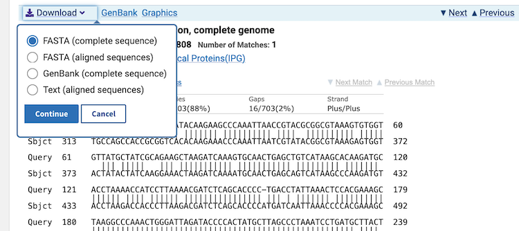

# Dataset compilation (Activity 1)

## Objective

In this activity we will identify homologous DNA sequences, retrieve public data, and prepare the data for analyses.  

Ultimately, over the next six activities, we aim to infer a time-calibrated phylogeny to estimate the number and timing of Charadriidae dispersal events (plovers, dotterels, and lapwings) to New Zealand (see [A research question](../reserach_question/README.md)).

## Table of contents

* [1.1 The dataset](#dataset)
* [1.2 Use BLAST to find missing sequences](#blast)
* [1.3 Batch-download remaining sequences](#batch)
* [1.4 Rename sequences](#rename)
* [1.5 Download and rename the CO1 sequences](#rename_co1)
* [(Optional) Download and rename the RAG1 sequences](#rag1)

## 1.1 The dataset

We will gather sequence data for three genes (12S, CO1, and RAG1) from 22 bird species (21 Charadriidae, including four New Zealand endemics, and one outgroup, *Haematopus ater*) using two databases ([NCBI](https://www.ncbi.nlm.nih.gov/) and [BOLD](https://www.boldsystems.org/)). 

  
Background: What are these genes? (click here)
 

--------

**12s** is a mitochondrial ribosomal RNA gene involved in translating messenger RNAs into mitochondrial proteins.  
**CO1** encodes a subunit of the mitochondrial cytochrome c oxidase complex.  
**RAG1** (Recombination activating gene 1), a nuclear gene, is part of a complex essential for antibody receptor recombination.  

These genes serve distinct roles in phylogenetic analyses due to their unique properties:

- Mitochondrial genes (12S, CO1) are maternally inherited, non-recombining, and mutate faster.
- Nuclear genes (RAG1) have biparental inheritance and evolve more slowly.

In terms of variability:

- 12S is the most variable (e.g., 30% nucleotide variation in humans).
- CO1 shows moderate divergence (~2% between closely related species).
- RAG1 is highly conserved, even among distantly related species.

--------

The table below lists the NCBI and BOLD gene accession numbers for the 22 selected species:

Species | Common name | 12s | CO1 | RAG1
:------ | :---------- | :-- | :-- | :--
*Anarhynchus frontalis* | Wrybill | EF380263 | BROM876-08 | EF373167
*Charadrius alexandrinus* | Kentish plover | NC_041118 | BROM673-07 | KM001511
*Charadrius australis* | Inland dotterel | EF373098 | BROM542-07 | EF373199
*Charadrius bicinctus* | Double-banded plover |  - | BROM726-07 | KM001515
*Charadrius collaris* | Collared plover |  - | BROM261-06 | AY339106
*Charadrius falklandicus* | Two-banded plover |  - | BROM677-07 | KM001524
*Charadrius mongolus* | Lesser Sand plover | MW298528 | KFIP072-07 | KM001542
*Charadrius morinellus* | Eurasian dotterel | EF373080 | BON196-07 | EF373182
*Charadrius obscurus* | New Zealand plover | KF357995 | BROM747-07 | KM001550
*Charadrius semipalmatus* | Semipalmated plover | EU167040 | BROM264-06 | KM001568
*Charadrius veredus* | Oriental plover |  - | BROM752-07 | KM001585
*Charadrius vociferus* | Killdeer | - | BROM395-06 | AF143736
*Elseyornis melanops* | Black-fronted dotterel | EF373078 | BROM405-06 | EF373180
*Oreopholus ruficollis* | Tawny-throated dotterel | EF373096 | BROM227-06 | EF373197
*Phegornis mitchellii* | Diademed plover | EF373099 | BROM439-06 | AY228781
*Pluvialis squatarola* | Grey plover | EF373101 | BROM665-07 | EF373202
*Thinornis novaeseelandiae* | Shore plover | EF373113 | BROM464-06 | EF373214
*Thinornis rubricollis*/cucullatus | Hooded dotterel |  - | BROM687-07 | KM001580
*Erythrogonys cinctus* | Red-kneed dotterel | EF373079 | BROM727-07 | EF373181
*Vanellus chilensis* | Southern lapwing | EF373115 | BROM468-06 | AY228772
*Vanellus Vanellus* | Northern lapwing | NC_025637 | GBIR3242-12 | AY339126
*Haematopus ater* | Blackish oystercatcher | NC_003713 | ROMC001-06 | AY228794

## 1.2 Use BLAST to find missing sequences

Some 12S accession numbers are missing because sequence data is unavailable for all species. However, new data may have been added recently. To search for homologous 12S sequences in Charadriidae using BLAST (the Basic Local Alignment Search Tool):

1. Visit the NCBI (National Center for Biotechnology Information) [BLAST website](https://blast.ncbi.nlm.nih.gov/Blast.cgi) and select **“Nucleotide BLAST”**.
2. Enter a 12S accession number (e.g., EF380263) in **“Enter Query Sequence”** (avoid numbers starting with "NC" or "MW" for whole mitochondrial sequences).
3. In "**Choose Search Set**”, restrict the “Organism" to “**Charadriidae (taxid:8907)**” and use the "**Highly similar sequences (megablast)**" algorithm.

<kbd></kbd>

Also have a look at the algorithm parameters by clicking on the blue "**+ Algorithm parameters**" option at the very bottom. 

<kbd></kbd>

 What is the default Word size in megablast?

  
Answer (click here)
 

--------

28 bp

--------

 If searching for highly diverged species, would you decrease or increase the Word size? How can you adjust the Scoring Parameters to improve detection of diverged species? Discuss with your neighbors!

  
Discussion points (click here)
 

--------

* Sequence divergence
* Number of expected mismatches
* Number of expected gaps
* Total length of sequence

--------

 
Once satisfied with your settings (for now, do not change the algorithm parameters), click “**BLAST**” to start the search.

After the search finishes, scroll down to view the results table with around 40 hits. Then, click the “**Taxonomy**” tab above the table.  

<kbd></kbd>

 To check if any of the six species with missing 12S sequences are included in the taxonomy list, use your browser's text search tool to look for them. If found, note how many hits appear for each species.

  
Answer (click here)
 

--------

In November 2024, there was only one species with additional 12s sequence data: *Charadrius vociferus* (Killdeer), for which four hits were found.

--------

 If there are multiple hits for one species, what criteria will you use to select the sequence for your dataset? Explore the NCBI links for relevant information and discuss the criteria with your neighbors.

  
Discussion points (click here)
 

--------

* Total sequence length
* Voucher specimen
* Information on sampling location 
* Available meta data (e.g., measurements, used already in other studies)

--------

Download the selected additional 12S sequence. There are multiple ways how to do this, e.g., in the **"Alignments"** tab next to the "Taxonomy" tab, locate your sequence, click the **"Download"** icon, select **"FASTA (complete sequence)"** and click **"Download"**.

<kbd></kbd> 

The downloaded file will have a non-descriptive name. Rename the file with the species name, gene ID, and accession number (e.g., `c_vociferus_12s_DQ485792.fasta`), then open it in a text editor.  

In FASTA format, the first line always starts with `>` (greater-than) symbol followed by a unique sequence description (e.g., accession number and uploader-provided name). The sequence itself appears below, either sequentially (in one line) or interleaved (on multiple lines).

## 1.3 Batch-download remaining sequences

Downloading all 12S sequences individually is tedious, so use NCBI's **"batch"** download feature:

1. Download the accession numbers file: [`12s_ncbi_accn.txt`](data/12s_ncbi_accn.txt). To save it, click the link, then **"Download raw file"**, or right-click "**Raw**" and select "**Save Link As…**".

2. Visit the [NCBI Batch Entrez website](https://www.ncbi.nlm.nih.gov/sites/batchentrez).

3. Select the “**Nucleotide**” database, click **"Browse"** to upload `12s_ncbi_accn.txt`, and click “**Retrieve**” and “**Retrieve records for 17 UID(s)**” to display the records. UID is the abbreviation for “unique identifier”. Verify they are the correct ones to download.

4. Click **"Send to"** (top-right), select **"Complete record"**, **"File"**, and **"FASTA"**, sorted by "**Organism name**". Rename the file to `12s_ncbi.fasta` and save in your working directory.

<kbd></kbd> 

## 1.4 Rename sequences

Open `12s_ncbi.fasta` in a text editor. It contains multiple FASTA-formatted sequences, similar to the single file you downloaded earlier. Many sequence descriptions have long names with special characters and spaces, which most analysis software cannot handle well. Rename descriptions to use only the accession number (without version info) followed by the species name, separated by underscores. For example:  
`>NC_003713.2 Haematopus ater mitochondrion, complete genome` becomes `>NC_003713_Haematopus_ater`.  
 
Refresh your bioinformatics knowledge and rename using the command line:  

**1\.** Open the Terminal and navigate to the folder containing the file `12s_ncbi.fasta`. 

  
Help! How? (click here)
 

--------
  
`cd path/to/your/file` (cd = **c**hange **d**irectory)

--------

**2\.**  Display the file content to confirm correctness.

  
Help! How? (click here)
 

--------

There are many options, e.g., `less`, `more`, `head`, `tail`, `nano`, `emacs`, etc... followed by the filename

--------

**3\.**  Count header lines (lines with the greater-than sign). Does the number match the expected sequences?  

  
Help! How? (click here)
 

--------

`grep ">" 12s_ncbi.fasta | wc -l`

Are you unfamiliar with the commands ? Check the manual (`man grep`, exit with `q`) or the help text (`grep -h`).  
Our file should have 17 header lines.

--------

**4\.**  Print the first five header lines on screen. Are they the first five sequence names? 

  
Help! How? (click here)
 

--------

`grep ">" 12s_ncbi.fasta | head -n 5`

--------

**5\.**  If the headers are correct, rename them and verify the result: 
`grep ">" 12s_ncbi.fasta | cut -d ' ' -f 1-3 | tr ' ' '_' | sed 's/\.[0-9]//g' | head -n 5`

  
Whats that code? (click here)
 

--------

The command processes sequence headers by filtering with `grep`, splitting with `cut` (`-d` specifies the field **d**elimiter as `space` and `-f` **f**ields to be cut as the columns 1 to 3), replacing spaces with underscores using `tr`, replacing version numbers with `sed`, and displaying the first 5 results with `head`, all connected by pipes (`|`) to pass output from one command to the next.

--------

Do the names look correct? If yes, replace `head -n 5` with `> 12s_ncbi_ed.fasta` to save the updated file. Verify the content to ensure the command worked.

## 1.5 Download and rename the CO1 sequences

Beyond NCBI or its European counterpart [ENA (European Nucleotide Archive)](https://www.ebi.ac.uk/ena/browser/home) databases like [BOLD (The Barcode of Life Data System) database](https://www.boldsystems.org/) specialize in information for DNA barcoding. 

  
Background: What is barcoding? (click here)
 

--------

Barcoding is a technique that uses standardized short genetic markers to identify a specimen as belonging to a particular species. It is also used to depict cryptic species, survey environmental samples, and support forensic studies.

--------

Like NCBI's “Batch Entrez”, BOLD allows bulk downloads. Visit the [BOLD website](https://v4.boldsystems.org/), select “**Data Portal**”, past the following UID’s into the search field, and click “**Search**”:

`BROM876-08 BROM673-07 BROM542-07 BROM726-07 BROM261-06 BROM677-07 KFIP072-07 BON196-07 BROM747-07 BROM264-06 BROM752-07 BROM395-06 BROM405-06 BROM227-06 BROM439-06 BROM665-07 BROM464-06 BROM687-07 BROM727-07 BROM468-06 GBIR3242-12 ROMC001-06`

<kbd></kbd> 

The site should show 22 records. Click the blue “Sequences: FASTA” icon to download, rename the file to `co1_bold.fasta`, and move it to your working directory.  

Inspect the content of the downloaded file. Does this file contain aligned FASTA sequences?

  
Answer (click here)
 

--------

Yes, the sequences include leading and trailing gap characters (dashes) for uniform length. Indeed, closely related species are well aligned, but the outgroup, *Haematopus ater*, is less well aligned.

--------

The sequence headers in the BOLD file are not machine-readable. Modify the bash command from section [1.4 Rename sequences](#rename) to reformat the headers. Keep the year in the UID but replace the dash with an underscore. For example: `>BON196-07|Charadrius morinellus|COI-5P|GU571332` to `>BON196_07_Charadrius_morinellus`.

  
Need help with the bash command? (click here)
 

--------

`cut -d '|' -f 1-2 co1_bold.fasta | tr ' |' '_' | sed '/^>/s/-/_/' > co1_bold_ed.fasta`

This command extracts the first two fields from each line separated by `|` (using `cut`), replaces spaces and `|` with underscores (`tr`), changes dashes to underscores in headers starting with `>` (`sed`), and saves the result to a new file.

--------

NOTE: The CO1 sequence for *Thinornis rubricollis* is labeled as *T. cucullatus* due to synonymy. Rename it (manually or with `sed`) to *Thinornis rubricollis* to avoid issues when comparing phylogenetic trees or concatenating data.

## (Optional) Download and rename the RAG1 sequences

As practice, you can NCBI batch-download and rename the RAG1 sequences using the accession numbers from [`rag1_ncbi_accn.txt`](data/rag1_ncbi_accn.txt), then save the file as `rag1_ncbi_ed.fasta`.

