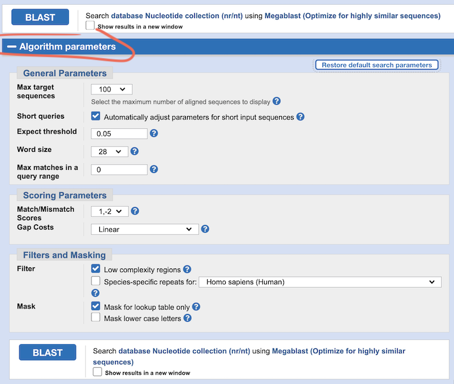

# Dataset compilation (Activity 1)

## Objective

In this activity we will identify homologous DNA sequences, retrieve publicly available data, and prepare this dataset for downstream analyses.  
Our ultimate goal after this and the following five Activities will be to infer a time-calibrated phylogeny that allows us to make an assumption about the number and timing of dispersal events of Charadriidae (including plovers, dotterels, and lapwings) to New Zealand (see [A research question](../reserach_question/README.md)).

## Table of contents

* [1.1 The dataset](#dataset)
* [1.2 Use BLAST to find missing sequences](#blast)
* [1.3 Batch-download remaining sequences](#batch)
* [1.4 Rename sequences](#rename)
* [1.5 Download and rename the CO1 sequences](#rename_co1)
* [(Optional) Download and rename the RAG1 sequences](#rag1)

## 1.1 The dataset

We are going to compile sequence information of up to three genes (12s, CO1, and RAG1) from 22 bird species (21 Charadriidae including four New Zealand endemics plus one outgroup species *Haematopus ater*) across two databases ([NCBI](https://www.ncbi.nlm.nih.gov/) and [BOLD](https://www.boldsystems.org/)). 

  
Background: What are these genes? (click here)
 

--------

**12s** corresponds to the mitochondrial 12s ribosomal (r)RNA gene, translating messenger RNAs into mitochondrial proteins.  
**CO1** is a protein-subunit of the cytochrome c oxidase complex and also encoded in the mitochondrial DNA.  
**RAG1** (Recombination activating gene 1) is a protein of a complex involved in antibody receptor recombination and encoded in the nuclear genome.  
  
The three sequences have unique properties that make them suitable for different phylogenetic analyses: They are encoded by different genomes – the mitochondrial genes are maternally inherited, non-recombining, and have a higher mutation rate than the nuclear genome. Nuclear genes on the other hand also have paternal inheritance. Of the three, the most variable is 12s (in humans, 30% of the nucleotides are variable), followed by CO1 where about 2% sequence divergence is typically detected between closely related species, and RAG1, which is highly conserved even among distantly related species.

--------

The table below lists the accession numbers for the sequences that are available on the NCBI or BOLD databases:

Species | Common name | 12s | CO1 | RAG1
:------ | :---------- | :-- | :-- | :--
*Anarhynchus frontalis* | Wrybill | EF380263 | BROM876-08 | EF373167
*Charadrius alexandrinus* | Kentish plover | NC_041118 | BROM673-07 | KM001511
*Charadrius australis* | Inland dotterel | EF373098 | BROM542-07 | EF373199
*Charadrius bicinctus* | Double-banded plover |  - | BROM726-07 | KM001515
*Charadrius collaris* | Collared plover |  - | BROM261-06 | AY339106
*Charadrius falklandicus* | Two-banded plover |  - | BROM677-07 | KM001524
*Charadrius mongolus* | Lesser Sand plover | MW298528 | KFIP072-07 | KM001542
*Charadrius morinellus* | Eurasian dotterel | EF373080 | BON196-07 | EF373182
*Charadrius obscurus* | New Zealand plover | KF357995 | BROM747-07 | KM001550
*Charadrius semipalmatus* | Semipalmated plover | EU167040 | BROM264-06 | KM001568
*Charadrius veredus* | Oriental plover |  - | BROM752-07 | KM001585
*Charadrius vociferus* | Killdeer | - | BROM395-06 | AF143736
*Elseyornis melanops* | Black-fronted dotterel | EF373078 | BROM405-06 | EF373180
*Oreopholus ruficollis* | Tawny-throated dotterel | EF373096 | BROM227-06 | EF373197
*Phegornis mitchellii* | Diademed plover | EF373099 | BROM439-06 | AY228781
*Pluvialis squatarola* | Grey plover | EF373101 | BROM665-07 | EF373202
*Thinornis novaeseelandiae* | Shore plover | EF373113 | BROM464-06 | EF373214
*Thinornis rubricollis*/cucullatus | Hooded dotterel |  - | BROM687-07 | KM001580
*Erythrogonys cinctus* | Red-kneed dotterel | EF373079 | BROM727-07 | EF373181
*Vanellus chilensis* | Southern lapwing | EF373115 | BROM468-06 | AY228772
*Vanellus Vanellus* | Northern lapwing | NC_025637 | GBIR3242-12 | AY339126
*Haematopus ater* | Blackish oystercatcher | NC_003713 | ROMC001-06 | AY228794

## 1.2 Use BLAST to find missing sequences

The table above is missing some accession numbers for the 12s sequences. That is, because publicly available sequence data is not available for all species. However, perhaps some new data was added recently. Using one of the available 12s sequences as query, we can use BLAST (the Basic Local Alignment Search Tool) to search for homologous 12s sequences from other Charadriidae species:

Go to the NCBI (National Center for Biotechnology Information) [BLAST website](https://blast.ncbi.nlm.nih.gov/Blast.cgi) and select **“Nucleotide BLAST”** to use a nucleotide sequence to search for other nucleotide sequences.

In the search field **“Enter Query Sequence”** enter the accession number (or the sequence) of one of the other 12s sequences of Charadriidae (don’t use the accession numbers stating with “NC” or “MW” as these correspond to whole mitochondrial sequences). In the "**Choose Search Set**” field, restrict the “Organism" to “**Charadriidae**” and keep the algorithm to search for "**Highly similar sequences (megablast)**". Have a look at the algorithm parameters by clicking on the blue "**+ Algorithm parameters**" option at the very bottom. 

<kbd></kbd>

 What is the default Word size in megablast?

  
Answer (click here)
 

--------

28 bp

--------

 If your search would be targeting very diverged species, would you shorten or increase the Word size? How could you adjust the Scoring Parameters to assure finding the diverged sequences? Discuss with your neighbors!

  
Discussion points (click here)
 

--------

* Sequence divergence
* Number of expected mismatches
* Number of expected gaps
* Total length of sequence

--------

For now, don't change the algorithm parameters, but just start the search by clicking on “**BLAST**”. Once the search is finished, scroll through the results, there should be around 38 hits.  

Go to the “**Taxonomy**” tab.  

<kbd></kbd>

 Of the six species that had missing 12s sequences, is there one or more included in this list? If so, how many hits were found?

  
Answer (click here)
 

--------

In November 2022, there was only one species with additional 12s sequence data: *Charadrius vociferus* (Killdeer), for which four hits were found.

--------

 If there are multiple hits, which criteria do you use to select the one sequence to include in your dataset? Where do you find  information about these criteria? Click on the different links within the NCBI page to explore which information you can find and discuss possible criteria with your neighbors.

  
Discussion points (click here)
 

--------

* Total sequence length
* Voucher specimen
* Information on sampling location 
* Available meta data (e.g., measurements, used already in other studies)

--------

Download the selected 12s sequence(s) for the species you found: In the “**Descriptions**” tab, click on the accession number for the available sequence(s), click on “**Send to**” in the upper right corner, select “**File**”, for “Format" choose “**FASTA**”, click “**Create file**”. 

<kbd></kbd> 

Rename the file with the species name, gene ID, and accession number (e.g., `c_vociferus_12s_DQ485792.fasta` and have a look at the content using a a text editor.  

In FASTA format, the first line always starts with a `>` (greater-than) symbol proceeded by a unique description of the sequence (here the accession number and a non-standardized name of the sequence given by the person who uploaded the sequence). Following this initial line is the actual sequence itself in one line ("sequential") or on multiple lines ("interleaved").

## 1.3 Batch-download remaining sequences

We could individually download the remaining 12s sequences, but NCBI also has a website to download multiple information, e.g., the sequence information for many accession numbers, at once. 

Go to the [NCBI Batch Entrez website](https://www.ncbi.nlm.nih.gov/sites/batchentrez). Select the “**Nucleotide**” database and upload the file [`12s_ncbi_accn.txt`](data/12s_ncbi_accn.txt). Click “**Retrieve**” and “**Retrieve records for 17 UID(s)**”. UID is the abbreviation for “unique identifier”. On the displayed website, quickly check that these are the correct sequences. Then proceed as before to download them in FASTA file format, but also sorted by "**Organism name**" (Send to > Complete record > File > FASTA > Sort by > Organism name > Create file). Rename the file to `12s_ncbi.fasta` and move it to your working directory.

## 1.4 Rename sequences

Open the file `12s_ncbi.fasta` in a text editor. The format is the same as for the single FASTA file you manually downladed before, just that it contains multiple FASTA formated sequences after each other. Many of the sequence descriptions have long names with special characters and white space that are usually not handled well by most analyses software. Therefore, we rename the sequences descriptions to a name using only the accession number without the version information (the part after the period) followed by the species name, separated by underscores instead of whitespace. For example: `>NC_003713.2 Haematopus ater mitochondrion, complete genome` will then be `>NC_003713_Haematopus_ater`.  
 
We will refresh your bioinformatics knowledge and do this on the command line using Bash:  

**1\.** Open the Terminal and navigate to the folder containing the file `12s_ncbi.fasta`. 

  
Help! How? (click here)
 

--------
  
`cd path/to/your/file` (change directory)

--------

**2\.**  Display the content of the file to check that you navigated to and downloaded the correct file.

  
Help! How? (click here)
 

--------

There are many options, e.g., `less`, `more`, `head`, `tail`, `nano`, `emacs`, etc... followed by the filename

--------

**3\.**  Only display the sequence header lines (following the greater-than sign) and count how many header lines there are.  

  
Help! How? (click here)
 

--------

`cat 12s_ncbi.fasta | grep ">" | wc -l`

Do you know the commands used above? If not, you may consult the manual (e.g., `man grep` (to exit the man pages, press `q`) or consult the help text (`grep -h`). Our file should have 17 header lines.

--------

**4\.**  Print the first five header lines on screen. Are those the first five sequence names in our file? 

  
Help! How? (click here)
 

--------

`cat 12s_ncbi.fasta | grep ">" | head -n 5`

--------

**5\.**  If these are the correct header lines, let's rename them and check the result: 
`cat 12s_ncbi.fasta | cut -d ' ' -f 1-3 | tr ' ' '_' | sed 's/\.[0-9]//g' | grep ">" | head -n 5`

  
Whats that code? (click here)
 

--------

With `cat` the file is read to standard out, with the pipe character `|` its content is forwarded to the program `cut`, where the `-d` flag specifies the field delimiter as being a `space` and the `-f` flag specifies the fields to be cut as the columns 1 to 3. With `tr` spaces are transformed to underscores, and with `sed` the period and any number thereafter is replaced with nothing. Finally, `grep` searches for the greater-than symbol and `head` prints the first 5 lines `-n 5`  on the screen.

--------

Do the reformatted names look like we want them? If yes, replace the last two commands `| grep ">" | head -n 5` with `> 12s_ncbi_ed.fasta` to save the sequences and their new headers to a new edited (“_ed") file. Check the content again to see that the command worked.

## 1.5 Download and rename the CO1 sequences

There are more databases than NCBI or its European counterpart [ENA (European Nucleotide Archive)](https://www.ebi.ac.uk/ena/browser/) that store molecular information. One example is the [BOLD (The Barcode of Life Data System) database](https://www.boldsystems.org/), which is the database for “DNA barcoding”. 

  
Background: What is barcoding? (click here)
 

--------

Barcoding is a technique that uses one or more standardized short genetic markers to identify a specimen as belonging to a particular species. It is also used to depict cryptic species, to survey environmental samples, and for forensic applications.

--------

Similarly to the NCBI “Batch Entrez” website, you can download multiple sequences at once. Go to the [BOLD website](https://www.boldsystems.org/) , click on “**Databases > Public Data Portal**”. 
Copy and paste the following UID’s into the search field and click “**Search**”:

`BROM876-08 BROM673-07 BROM542-07 BROM726-07 BROM261-06 BROM677-07 KFIP072-07 BON196-07 BROM747-07 BROM264-06 BROM752-07 BROM395-06 BROM405-06 BROM227-06 BROM439-06 BROM665-07 BROM464-06 BROM687-07 BROM727-07 BROM468-06 GBIR3242-12 ROMC001-06`

<kbd></kbd> 

The site should now display 22 records. Click on the blue “Sequences: FASTA” icon on the right to download the sequences. Rename the file to `co1_bold.fasta` and move it to your working directory. 

Go to the Terminal and inspect the content of the downloaded file. Does this file contain aligned FASTA sequences?

  
Answer (click here)
 

--------

Yes, because the sequences have leading and trailing “gap” characters (here dashes) that adjust them to the same length. Indeed, more closely related species are already well aligned, but *Haematopus ater* is not.

--------

The names in the sequence headers are again not very machine-readable. Adjust the code from section [1.4 Rename sequences](#rename) to rename the headers. Note, there is no “version” number in the BOLD UIDs, instead the number after the dash corresponds to the year the sequence was added to the database. The year is part of the UID, so we need to keep it, but we could replace the dash with an underscore. For example, we could change `>BON196-07|Charadrius morinellus|COI-5P|GU571332` to `>BON196_07_Charadrius_morinellus`.

  
Answer (click here)
 

--------

`cat co1_bold.fasta | cut -d '|' -f 1-2 | tr ' ' '_' | tr '|' '_' | tr '-' '_' > co1_bold_ed.fasta`

--------

NOTE: Because *Thinornis rubricollis* is also known by the synonym *Thinornis cucullatus*, the CO1 sequence is labeled with *T. cucullatus*. This will be problematic if we compare the phylogenetic trees or concatenate the data, so rename this sequence (manually or with `sed`) to *Thinornis rubricollis*.

## (Optional) Download and rename the RAG1 sequences

As additional practice, you can batch-download and rename the RAG1 sequences based on their accession numbers provided in [`rag1_ncbi_accn.txt`](data/rag1_ncbi_accn.txt). Save the new file as `rag1_ncbi_ed.fasta`.

