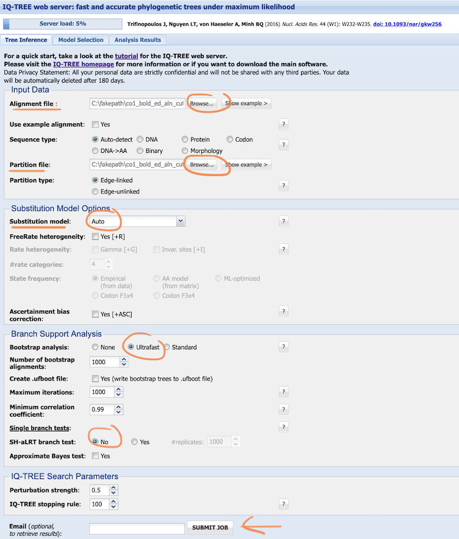
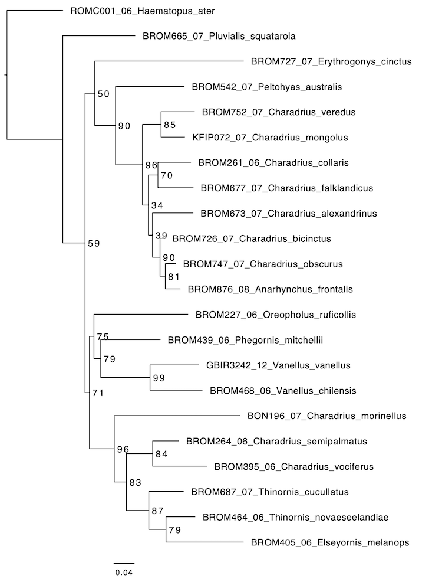

# Maximum Likelihood Phylogenetic Inference (Activity 4)

## Objective

Find the phylogenetic hypothesis that best explains the data. So far, we have learned how to retrieve homologous sequences ([Activity 1](../dataset_compilation/README.md)), how to align these sequences to match homologous sites ([Activity 2](../multiple_sequence_alignment/README.md)), and how to find the best-fit substitution model for our data [Activity 3](../substitution_model_selection/README.md). In this tutorial, we will now perform maximum likelihood (ML) phylogenetic inference with the best-fit substitution model to find the best phylogenetic hypothesis for our data.

## Table of contents

* [4.1 Run ML inference for the 12s alignment using a predefined substitution model](#ml_TIM2_12s)
* [4.2 Visualize the trees using a tree viewer](#tree_viewer)
* [4.3 Assess node support with bootstrapping](#bs)
* [4.4 Codon-position partitioned maximum-likelihood inference](#partitioned_ml)
* [4.5 Phylogenetic inference with concatenated alignments](#concat_ml)

## 4.1 Run ML inference for the 12s alignment using a predefined substitution model

 

  
Background: Maximum likelihood phylogenetic inference (click here)
  
  
--------

Maximum-likelihood phylogenetic inference aims to find the parameter values of an evolutionary model that maximize the likelihood of observing the dataset at hand. The model parameters include the tree topology, its branch lengths, and all parameter of the substitution model. As the search space is enormous when the dataset contains more than just a few taxa, heuristic algorithms are usually used to reach the maximum-likelihood combination of parameter values. In this activity we will again use [IQ-TREE](http://iqtree.cibiv.univie.ac.at) ([Nguyen et al. 2015](https://doi.org/10.1093/molbev/msu300)), as we did already in [Activity 3](../substitution_model_selection/README.md).

--------

### 4.1.1 Infer the ML tree using the TIM2+F+I+G4 substitution model

In [Activity 3](../substitution_model_selection/README.md), we used the “Model Selection” function in IQ-TREE to find the best fit substitution model according to AIC, which was “TIM2+F+I+G4” (the “transition model” with variable base frequencies, variable transition rates, but two transversion rates that are set to be identical: AC=AT and CG=GT). Now, apply this model with the 12s alignment to perform a maximum-likelihood search.  

Go to the [IQ-TREE web server](http://iqtree.cibiv.univie.ac.at), stay at the first tab “**Tree inference**”. In the “**Input Data**” section, upload again the 12s alignment file ([`12s_ncbi_ed_cut_realn_filtered.fasta`](../multiple_sequence_alignment/res/12s_ncbi_ed_cut_realn_filtered.fasta)) in the “**Alignment file**” field.  
Then go to the “**Substitution Model Options**” tab. Because we already know the best-fit substitution mode, change the “Substitution model” from “Auto” to “TIM2” ("Auto" would repeat the model selection). Also check the boxes for “**Gamma [+G]**” and “**Invar. Sites [+I]**” and keep "4" as the number of rate categories. Then proceed to the “**Branch Support Analysis**”. Tick the “None” box for “**Bootstrap analysis**” and the “No” box for “**Single branch tests**”. We will do bootstrapping in [section 4.3](#bs) of this activity. Leave all other fields at their default, click “**submit job**”.

  
Optional: Command for locally installed IQ-TREE (click here)

--------

`PATH/TO/iqtree -s PATH/TO/12s_ncbi_ed_cut_realn_filtered.fasta -m TIM2+I+G4+F`

--------

<kbd></kbd>

 Go to the “**Analysis Results**” tab where your ML analysis is listed. It should again have finished almost immediately, which you will see in the sub-tab “**Summary**”. Next to it, the “**Run Log**” and the “**Full Result**” can be viewed. Inspect both and compare and discuss the results with your neighbour.

  
Features of the log and result files (click here)

--------

The beginning of the **log file** is similar to the log file obtained for model selection in [Activity 3](../substitution_model_selection/README.md), but the “ModelFinder” block is missing. That is, because we already specified the model, so no additional search has to be done. Instead, the algorithm directly jumps to the **optimization of +I and +G** (invariant sites and gamma rate variation) parameters. Afterwards, a list of candidate **parsimony trees** is computed, which are used as starting trees in a topology optimization procedure doing a “**NNI search**” (standing for “nearest neighbor interchange”). NNI is an algorithm of tree re-arrangement in which the nearest branches are swapped. You can see that at the end of this step, the tree with the best likelihood is kept. The algorithm does some further optimizations before the final tree, the final likelihood, the rate parameters, base frequencies, etc. are reported.

Note: you may get the warning “Estimated model parameters are at boundary that can cause numerical instability”. If you have a look at the rate parameters, you may notice that the rate for C-T transitions is close to 100, which is the maximum value, likely causing this warning.

The results file only differs from the previous ModelFinder results file in that it now reports the maximum likelihood tree. Note that IQ-TREE always produces an unrooted tree.

--------

Download these results by clicking on the link “**Download selected jobs**”, rename the results folder to [`12s_TIM2_I_G4_F`](./res/12s_TIM2_I_G4_F).

### 4.1.2 Re-run the ML inference with the Jukes-Cantor (JC) substitution model

On the [IQ-TREE web server](http://iqtree.cibiv.univie.ac.at) in the "**Tree Inference**" tab, upload again the 12s alignment file [`12s_ncbi_ed_cut_realn_filtered.fasta`](../multiple_sequence_alignment/res/12s_ncbi_ed_cut_realn_filtered.fasta) in the “**Alignment file**” field. Then go to the “**Substitution Model Options**” tab and change the “Substitution model” from “Auto” to “JC”. Do <ins>not</ins> tick the boxes for “Gamma [+G]” and “Invar. Sites [+I]”. Tick the “None” box for “**Bootstrap analysis**” and the “No” box for “**Single branch tests**”. Leave all other fields at their default, then click “**submit job**”.

  
Optional: Command for locally installed IQ-TREE (click here)

--------

`PATH/TO/iqtree -s PATH/TO/12s_ncbi_ed_cut_realn_filtered.fasta -m JC+F`

--------

Have a quick look at the “**Run Log**” and the “**Full Result**”. You can see that under the JC model, equal base frequencies and equal substitution rates are assumed.

Download these results by clicking on the link “**Download selected jobs**”, rename the folder to [`12s_JC`](./res/12s_JC). We will compare the ML trees inferred by the different evolutionary models in part 4.2 below.

## 4.2 Visualize the trees using a tree viewer

The downloaded results folder [`12s_TIM2_I_G4_F`](./res/12s_TIM2_I_G4_F) contains a file with the ending [`.treefile`](./res/12s_TIM2_I_G4_F/12s_ncbi_ed_cut_realn_filtered.fasta.treefile), containing the ML tree. 

 Open the file in a text editor. Which format has the “.treefile”? What are the numbers after the colon? 

  
Answer (click here)

--------

This treefile is written in the Newick format. Clades are grouped by parentheses, names of species within a clade are separated by commas, and branch lengths are given after the colon.

--------

To better visualize and also edit the tree, we will use the program [FigTree](https://github.com/rambaut/figtree/releases/tag/v1.4.4). Download the [`.dmg`](https://github.com/rambaut/figtree/releases/download/v1.4.4/FigTree.v1.4.4.dmg) for Mac users, [`.zip`](https://github.com/rambaut/figtree/releases/download/v1.4.4/FigTree.v1.4.4.zip) for Windows, or [`.tgz`](https://github.com/rambaut/figtree/releases/download/v1.4.4/FigTree_v1.4.4.tgz) for Linux). If you have problems installing FigTree, an [online tree viewing and editing tool](https://itol.embl.de/upload.cgi) may be used instead.

  
FigTree is not working... (click here)

--------

* For Windows/Linux users: try to fix by installing/updating to the newest java version.

* For Mac users:
	* Try to fix by installing/updating to the newest java version. To do so, go to the terminal:
	`java -version` (Check the installed version)
	`brew install openjdk` (If you don't have homebrew, follow instructions [here](https://brew.sh/).
	To have openjdk in your PATH, run:
	`echo 'export PATH="/usr/local/opt/openjdk/bin:$PATH"' >> ~/.zshrc`
	`source ~/.zshrc`
	`java -version` (Check the installed version)

	* The app is till not responding? Update the "universalJavaApplicationStub".
	`cd /Applications/FigTree\ v1.4.4.app/Contents/MacOS`
	`curl -O https://raw.githubusercontent.com/tofi86/universalJavaApplicationStub/master/src/universalJavaApplicationStub`
	`chmod 755 universalJavaApplicationStub`

	* The app is till not responding? Try opening from the terminal:
	`java -jar /Applications/FigTree\ v1.4.4.app/Contents/Resources/Java/figtree.jar`

--------

Open the [`.treefile`](./res/12s_TIM2_I_G4_F/12s_ncbi_ed_cut_realn_filtered.fasta.treefile) in [FigTree](https://github.com/rambaut/figtree/releases/tag/v1.4.4) and familiarize yourself with the "**Layout**" options in the left panel. You may "**Zoom**" in or "**Expand**" the tree to increase visibility of certain clades. You can also increase the "**Font Size**" of the "**Tip Labels**" (click on the triangle to the left of "Tip Labels" to open it).

Then, remember that IQ-TREE produced an unrooted tree, so the way the phylogeny is rooted is arbitrary. However, we included *Haematopus ater*, belonging to the family Haematopodidae, while all other species belong to the family Charadriidae. Thus, the correct root of the phylogeny must lie between *Haematopus ater* and the other taxa. Search for the branch leading to *Haematopus* (command-f on a Mac or go to Edit > Find and search for Haematopus, the tip will be highlighted). Click on the branch that leads to this species to select it. Then click on the “**Reroot**” icon with the yellow arrow in the upper panel to reroot the tree. 
Then, sort the taxa according to node order. To do so, click "**Decreasing node order**" in FigTree's "**Tree**" menu (or hit command-d on a Mac). This should move *Haematopus ater* to the top of the tree.

<kbd></kbd>
 
 Inspect the phylogeny. Does the genus *Charadrius* appear monophyletic in this phylogeny? 

  
Answer (click here)

--------

No, if you search for “Charadrius” to highlight these taxa, you will see that they are split into multiple clades in this phylogeny.

--------

 Tick the box for “**Branch labels**” on the left side. Some numbers are added to the branches. What do these numbers tell us?

  
Answer (click here)

--------

These are the branch lengths in inferred numbers of substitutions per site.

--------

Keep the window with the current tree open and in addition open the [`.treefile`](./res/12s_JC/12s_ncbi_ed_cut_realn_filtered.fasta.treefile) inferred with the _JC model_. Also "**Reroot**" this tree with *Haematopus ater* at the base and order the taxa according to "**Decreasing node order**". To compare the two trees you may have to rotate some nodes to have a comparable order of species. To do so, select the branch to rotate and click on the “**Rotate**” icon with the blue arrows. 

 Are the topologies concordant or did the differing substitution models result in different topologies?

  
Answer (click here)

--------

They are not concordant. In fact, the two phylogenies show major differences in topology, demonstrating that model selection is highly relevant. The use of one or another model may affect many stages of phylogenetic inference and the inferred phylogenetic hypothesis may be incorrect when the assumed model of evolution is poorly fitting.

<kbd></kbd>

--------

## 4.3 Assess node support with bootstrapping

The phylogenies of 12s sequences inferred with different models of substitutions do not agree with each other. However, so far, we have no indication of the reliability of the individual nodes in the phylogeny; therefore, we cannot assess how strong the evidence of one phylogeny weighs against other findings. To identify which nodes in the phylogeny are more or less trustworthy, we can perform a bootstrap analysis.

Go again to the [IQ-TREE web server](http://iqtree.cibiv.univie.ac.at), stay on the first tab “**Tree inference**”, upload again the 12s alignment file ([`12s_ncbi_ed_cut_realn_filtered.fasta`](../multiple_sequence_alignment/res/12s_ncbi_ed_cut_realn_filtered.fasta)), go to the “**Substitution Model Options**” tab and change the “**Substitution model**” from “Auto” to “**TIM2**”. Also check the boxes for inferring “**Gamma [+G]**” and “**Invar. Sites [+I]**”. Then proceed to the “**Branch Support Analysis**” tab. This time we keep the “**Ultrafast**” check box next to “**Bootstrap analysis**” checked, but tick the “**No**” box for the SH-aLRT branch test.

Leave all other fields at their default values, click “**submit job**”. The analysis should not take much longer than the previous one. 
Download the results by clicking on the link “**Download selected jobs**”, rename the folder to [`12s_TIM2_I_G4_F_bs`](./res/12s_TIM2_I_G4_F_bs).

  
Optional: Command for locally installed IQ-TREE (click here)

--------

`PATH/TO/iqtree -s PATH/TO/12s_ncbi_ed_cut_realn_filtered.fasta -m TIM2+I+G4+F -bb 1000`

--------

  
Background IQ-TREE Bootstrap (click here)

--------

The ultrafast bootstrap approximation in IQ-TREE was optimized for larger datasets and – unlike the standard bootstrap method for which the IQ-TREE web server allows maximally 100 bootstrap replicates – it is recommended to run it with a minimum of 1,000 replicates. With these settings, IQ-TREE will produce 1,000 pseudo-replicate alignments and for each of the alignments infer a maximum likelihood phylogeny. Yet, the algorithm may stop earlier if it detects that the resulting node-support values are stable.  
The SH-aLRT branch test is another method to obtain branch support. In IQ-TREE you can obtain both values in one run, but we do not elaborate on the SH-aLRT branch test here.

--------

Open the tree file ending in [`12s_ncbi_ed_cut_realn_filtered.fasta.treefile`](./res/12s_TIM2_I_G4_F_bs/12s_ncbi_ed_cut_realn_filtered.fasta.treefile) in FigTree. FigTree recognizes that there are other labels in addition to species IDs and branch length and asks you to provide a name for these labels. As these are our bootstrap support values, you may simply name them “bootstrap” or “bs”.

Once again, "**Reroot**" the tree with *Haematopus ater* and sort all taxa according to "**Decreasing node order**". In principle, the phylogeny should now look exactly as the first one using the TIM2 substitution model without bootstraps, given that the maximum-likelihood inference should be independent of the additional bootstrap procedure. The bootstrap procedure is actually a convenient combination of analyses of bootstrapped alignments and the original alignment: The phylogeny is based on the original alignment and the support values are based on the bootstrapped alignments. However, due to stochastic variation in the inference, it is possible that IQ-TREE does not always find the actual maximum-likelihood phylogeny, but instead one with a slightly different likelihood. 

 Compare the likelihoods of the two analyses with and without bootstrap (“**Best score found**” in the log file, or “**Log-likelihood of the tree**” in the results file). Are they identical? 

  
Answer (click here)

--------

The likelihood may or may not be identical. If it is different from the previously inferred likelihood, it is worth checking the parameter estimates for the substitution model between the two analyses. In my analysis, all parameter estimates differed slightly, indicating that this relatively small dataset may not be informative enough to estimate all parameters reliably.

--------

Now, return to FigTree. To see the node-support values based on bootstrapping, set a tick in the checkbox for "**Node Labels**", open the options using the little arrow, and select "bootstrap" (or whatever name you gave it) from the "**Display**" drop-down menu.  

 Look at the bootstrap values. Strong values are usually considered to be above 90, for ultrafast bootstrap even above 95, meaning that more than 95% of the bootstrap replicates include this node. Can this phylogeny be considered reliable?

  
Answer (click here)

--------

The bootstrap support values indicate that most nodes of the phylogeny are not particularly reliable. Only few nodes are supported with moderately strong values above 90, and some nodes are supported even with support values below 50. This overall low support for this phylogeny is not surprising given that it was built from a short alignment of a single marker. One of the most strongly supported nodes is the monophyly of the southern and northern Lapwing (*Vanellus chilensis* and *Vanellus vanellus*). Note, there is no bootstrap support value on the node (*i.e.*, the branch) leading from *Haematopus ater* to all other species because in the ML analyses the branch leading to the outgroup is essentially a terminal branch that is just for visualization drawn as the root.

<kbd></kbd>

--------

## 4.4 Codon-position partitioned maximum-likelihood inference

Given that node support in the phylogeny for 12s sequences turned out to be poor, we'll try now if the CO1 alignment leads to a better-supported phylogeny. Because the CO1 sequence is protein-coding, it may be reasonable to use separate substitution models for each codon position, so we will partition the alignment accordingly. Recall that in the Nexus file the codon positions were specified in a block near the end of the file. Here we will use a similar format for partitioning the data. Have a look at the [partition file](./data/co1_bold_ed_aln_cut_partitions.txt): ”codon1", "codon2", and "codon3" are names for the individual partitions and "1-850\3" specifies that each third site, counting from position 1 (thus sites 1, 4, 7,...) should be considered part of this partition.

Go to the [IQ-TREE web server](http://iqtree.cibiv.univie.ac.at), upload the alignment [`co1_bold_ed_aln_cut.fasta`](../multiple_sequence_alignment/res/co1_bold_ed_aln_cut.fasta). Below, in the field “**Partition file**”, upload the partition file: [partition file](./data/co1_bold_ed_aln_cut_partitions.txt). This time, keep the “**Auto**” option for “**Substitution model**”. Since we did not perform model selection for the CO1 alignment before, we will now do it jointly with the phylogenetic inference. Also keep the “**Ultrafast**” bootstrap, but again click “**No**” in the box next to SH-aLRT. Leave all other fields at their defaults, click “**submit job**”.

  
Optional: Command for locally installed IQ-TREE (click here)

--------

`PATH/TO/iqtree -s PATH/TO/co1_bold_ed_aln_cut.fasta -spp PATH/TO/co1_bold_ed_aln_cut_partitions.txt -pre co1_bold_ed_aln_cut_codonpart -m TEST -bb 1000`

--------

<kbd></kbd>

Download the results by clicking on the link “**Download selected jobs**”, rename the folder to [`co1_codonpart_bs`](./res/co1_codonpart_bs).

 Have a look at the log file. Below the list of species you will now find that IQ-TREE loaded the partitions model. The fifth column “**Infor**” lists the number of parsimony-informative sites. Which codon position (subset) has the most parsimony-informative sites?

  
Answer (click here)

--------

The first position has 17 sites, the second none, and the third has 203. This reflects the redundancy of the genetic code at the third position. 

--------

 If you look at the next section, you will find the substitution models inferred by “ModelFinder”. Which substitution models were selected for the 1st, 2nd, and 3rd codon position? Discuss with your neighbours if these selections make sense (you may look up the parameter behind the models on the [IQ-TREE substitution-models site](http://www.iqtree.org/doc/Substitution-Models).

  
Points to discuss (click here)

--------

* transversion rates
* transition rates
* base frequencies
* invariant sites

--------

  
Answer (click here)

--------

In my analysis, the best model for the 1st codon position was “TNe+I”, a variation of the Tamura-Nei model assuming equal transversion rates, variable transition rates, equal base frequencies, and adding the +I for invariant sites. Since we have a lot of invariant sites at the 1st codon position, this may make sense. 

For the 2nd position, F81+F was selected. F81 is similar to the JC model in that all substitutions are equally likely, but it allows for variable base frequencies (+F). Since we do not have any parsimony-informative sites at this position, it makes sense to choose a very simple model with few parameters. 

The 3rd position is the most variable, so here TIM3+F+G4 was inferred in my analysis. There are only few invariant sites in third codon positions, so +I is not needed. TIM is the “transition model” with variable base frequencies, variable transition rates, but only two transversion rates.

--------

Now open the file [`co1_bold_ed_aln_cut.fasta.treefile`](./res/co1_codonpart_bs/co1_bold_ed_aln_cut.fasta.treefile) in [FigTree](https://github.com/rambaut/figtree/releases/tag/v1.4.4), name the node labels “bootstrap” or “bs”, and once again “**Reroot**” (*Haematopus ater*) and sort ("**Decreasing node order**") the phylogeny. To display the node-support values based on bootstrapping, set a tick in the checkbox for "**Node Labels**", open the options using the little arrow, and select "bootstrap" (or "bs") from the "**Display**" drop-down menu.  

 Does the CO1 phylogeny look more reliable compared to the 12s phylogeny?

  
Answer (click here)

--------

The CO1 phylogeny indeed seems to be more reliable than the 12s phylogeny with five nodes having a support of 90 or higher. This may not be surprising given that this alignment is also longer and has about twice as many parsimony-informative sites.

<kbd></kbd>

--------

  
Optional: Automated partitioning (click here)

--------

Instead of forcing IQ-TREE to use separate partitions for each of the three codon positions, we could also allow IQ-TREE to determine the ideal partitioning scheme itself. This way, it will start with the full partition model and subsequentially merge the partitions until the model fit does not increase any further. To do this, you must have installed IQ-TREE locally on your computer (this option is not available on the web interface). Then, use the -m MFP+MERGE option:

`PATH/TO/iqtree -s PATH/TO/co1_bold_ed_aln_cut.fasta -spp PATH/TO/
co1_bold_ed_aln_cut_partitions.txt -pre co1_bold_ed_aln_cut_partfinder —m MFP+MERGE -bb 1000`

--------

## 4.5 Phylogenetic inference with concatenated alignments

The comparison of phylogenies based on the short 12s alignment and the longer CO1 alignment showed that the overall node support can substantially be improved with increased size of the dataset. It is thus usually beneficial to use the information from several alignments jointly in one and the same phylogenetic analysis. To this end, the individual alignments were concatenated (simply pasted together), using [catfasta2phyml](https://github.com/nylander/catfasta2phyml), and a [partition scheme](./data/12s_co1_rag1_partitions.txt) based on genes and codon positions was generated.

For the last time today, go to the [IQ-TREE web server](http://iqtree.cibiv.univie.ac.at), und upload the alignment [`12s_co1_rag1.fasta`](./data/12s_co1_rag1.fasta). Also upload the associated partition file [`12s_co1_rag1_partitions.txt`](./data/12s_co1_rag1_partitions.txt) (you can download those files to your computer by clicking on the links above, then click the "**Download raw file**" button at the top of the file). Again, keep the “**Auto**” option for “**Substitution model**”, keep the “**Ultrafast**” bootstrap, but click “**No**” in the box next to SH-aLRT. Leave all other fields at their defaults, click “**submit job**”.  
Once the run is finished, download the results by clicking on the link “**Download selected jobs**”, rename the folder to [`12s_co1_rag1_codonpart_bs`](./res/12s_co1_rag1_codonpart_bs).

  
Optional: Command for locally installed IQ-TREE (click here)

--------

`PATH/TO/iqtree -s PATH/TO/12s_co1_rag1.fasta -spp 12s_co1_rag1_partitions.txt -pre 12s_co1_rag1_part_bs -m MFP+MERGE -bb 1000`

--------

Note that for partitioned analysis, IQ-TREE will assume that all partitions, and thus the 12s, CO1, and RAG1 sequences share the same true evolutionary history. The concatenation of genes may bias the result if this assumption is violated (which is common, particularly if closely related species are investigated, due to incomplete lineage sorting and/or introgression – you will hear more about this in the “Phylogenomics” lecture. However, given our dataset, the assumption that the 12s, CO1, and RAG1 genes share the same evolutionary history – or at least the same true topology – may be justified.

Open the [`12s_co1_rag1.fasta.treefile`](./res/12s_co1_rag1_codonpart_bs/12s_co1_rag1.fasta.treefile) file in FigTree, name the node labels again “bootstrap” or “bs”, and once again “**Reroot**” (*Haematopus ater*) and sort ("**Decreasing node order**") the phylogeny, set a tick in the checkbox for "**Node Labels**", open the options using the little arrow, and select "bootstrap" (or "bs") from the "**Display**" drop-down menu.

 How does node support of this phylogeny compare to the previous CO1 phylogeny?

  
Answer (click here)

--------

Actually, the overall node support is not better. Some nodes are better supported, but some are less supported. This may indicate that there actually is some contradicting information in our dataset, which may be due to the combined use of mitochondrial and nuclear markers.

<kbd></kbd>

--------

 Is the genus *Charadrius* now monophyletic? 

  
Answer (click here)

--------

No, still not. Even if some nodes are not very well supported, the clade including *Charadrius bicinctus*, *C. obscurus*, as well as the monotypic *Anarhynchus frontalis* plus some other plovers is strongly supported to form a monophyletic clade including the lapwings (genus *Vanellus*). The other clade, including *C. morinellus*, *C. vociferus*, and *C. semipalmatus* and four other species is also rather well supported.

--------

 Find the four New Zealand endemic species. Can you already tell if they originated from one or several dispersal events?

  
Answer (click here)

--------

Since *T. novaeseelandiae* is included in a clade widely separated from the other three endemic species (*C. bicinctus*,  *A. frontalis*, and *C. obscurus*, highlighted in yellow), it seems reasonable to assume that these originate from separate dispersal events. 

However, among *A. frontalis*, *C. obscurus*, and *C. bicinctus* there may be two possible scenarios: Either, the ancestor of this clade dispersed to New Zealand giving rise to all three species, followed by a second dispersal event back to Australia/Asia, giving rise to *C. alexandrinus* and the other four Charadrius species in this clade (highlighted in orange). Or, the two sister species *A. frontalis* and *C. obscurus* may have originated from one dispersal event, while *C. bicinctus* stems from yet another one.

<kbd></kbd>

--------

