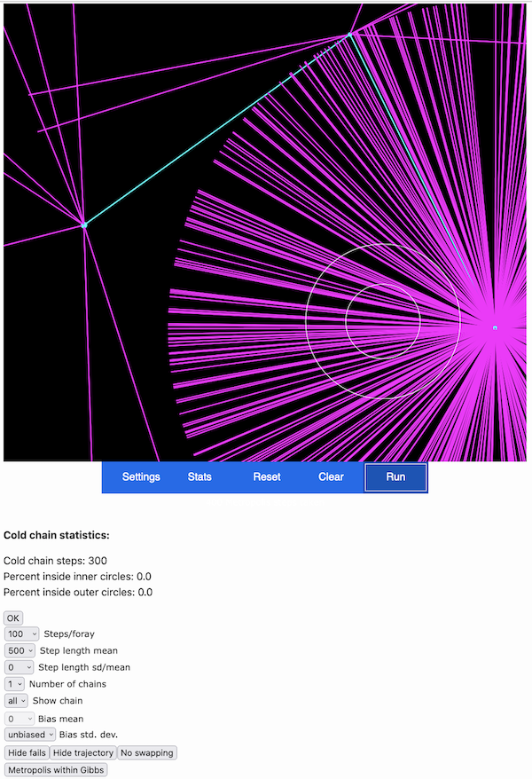

# Testing Markov chain Monte Carlo with the MCMC robot (Activity 5)

## Objective

Practice Markov chain Monte Carlo (MCMC) sampling. MCMC can be used to sample from a probability distribution. Similar to hill-climbing, the algorithm can get stuck on local optima and its success to explore the parameter space sufficiently depends on – for example – the step operator or a scale operator. 

## Table of contents

* [5.1 Flat parameter space](#flat)
* [5.2 Simple parameter space](#simple)
* [5.3 Complex parameter space](#complex)
* [Optional: other parameter settings](#mcmc_opt)

## 5.1 Flat parameter space

Go to Paul Lewis' [MCMC Robot webpage](https://plewis.github.io/applets/mcmc-robot/). With an iPhone or iPad, you can also download the app “MCMC Robot” from the App Store (the description given below may not exactly fit the appearance in the app).

Click on the **outer white ring** in the black square and press delete to remove the “peak” (the two white rings should disappear). Under **Settings** in the blue menu below the black square set "**Step length sd/mean**" from 1 to 0 and click on “**Hide fails**” to deactivate it (the button changes to "show fails"). Then click on the blue “**Run**” button to perform 100 steps of the MCMC. Repeat clicking the button (10-30 times) to continue the chain.

<kbd></kbd>

 How is the parameter landscape explored (how is the distribution and step length)?

 

  
Answer (click here)
  

--------

The MCMC should explore the two-dimensional parameter landscape evenly since no probability peaks are defined. All steps will appear uniformly large.

--------

Click on "**Clear**" to remove the MCMC chain. Then go back to **Settings** and change the "**Step length sd/mean**" to 10. Click on the “**Run**” button again a few times. You should see that the size of the steps now differs.

## 5.2 Simple parameter space 

Click on "**Clear**" to remove the MCMC chain. Then click somewhere in the black square and drag the mouse to define the size of a “hill” (a probability peak). By clicking inside the circle you can drag the hill to another place. The two circles of the hill represent the contours of the 95% and 50% probability mass.
Leave the other settings unchanged and click the “**Run**” button repeatedly. 

<kbd></kbd>

 How is the parameter landscape explored this time?

 

  
Answer (click here)

--------
  
You should see that the MCMC chain quickly finds the probability peak, and that it rarely leaves it afterwards.

Click on “**Stats**” to check that about 50% of MCMC samples fall within the 50% contour and 95% within the 95% contour, as expected. Performing more steps will bring these percentages closer to 50% and 95%. 

--------

So far, we’ve only seen blue lines and dots representing states accepted by the MCMC algorithm, which are part of the MCMC chain.  

Activate “**Show fails**”  in the Settings menu (you may need to re-run the chain). You should now see purple lines representing proposed states with lower probabilities that were not accepted. These purple lines tend to surround the blue ones and the probability peak because lower-probability states, further from the peak, are less often accepted. Re-running the chain with “Show fails” on may make this pattern clearer.

<kbd></kbd>

Click on "**Clear**" to remove the MCMC chain. Change the **"Step length mean"** to 500 and set a standard deviation of the step size (**Step length sd/mean**) of 0.

 How do these settings affect the discovery of the probability peak by the MCMC? Why do you see this pattern?

 

  
Answer (click here)

--------
  
You should notice that the MCMC has difficulties reaching the center of the probability peak because it must first land in an accepted position 150 units away from it. Consequently, the chain appears to from a ring from which states further outside are proposed but almost always rejected. After clicking “**Run**” several times, check the “**Stats**” for this chain. You may find that much fewer than 50% and 95% of the samples fall within the 50% and 95% contours, highlighting the importance of flexible step sizes for proper MCMC behavior.

<kbd></kbd>

--------

## 5.3 Complex parameter space 

"**Clear**" the MCMC chain and deactivate “**Show fails**”. Keep the large **"Step length mean"** (500) and the minimal standard deviation of the step size (0). In the black square, add a second hill in the opposite corner of the first with a similar size to the first hill. Click “**Run**” a few times. You'll notice that almost all accepted steps cross from one peak to the other, while the areas of the individual peaks are not explored homogeneously by the MCMC chain. 

<kbd></kbd> 


Change the **"Step length mean"** to 50 and the standard deviation (**Step length sd/mean**) to 10 and Run the MCMC chain again for a few thousand steps. You should observe that while the chain mostly stays within one peak, it occasionally moves between peaks, eventually exploring both evenly. Check the "Stats" to confirm that approximately 50% and 95% of the samples are within the 50% and 95% contours.

Clear the screen again and change the starting position by clicking once somewhere in the black square. Click on “**Run**” again a couple of times. Does it change which peak is explored more thoroughly?

 Discuss with your neighbours which settings of the MCMC chain seem to be important, how the parameter landscape can influence the exploration of the MCMC chain and why different starting positions and step lengths are important.

## Optional: other parameter settings

Explore the MCMC robot a bit more. For example, add further hills, have a low (small) and high (large) hill, add an additional chain. There are also more options in the app.

 