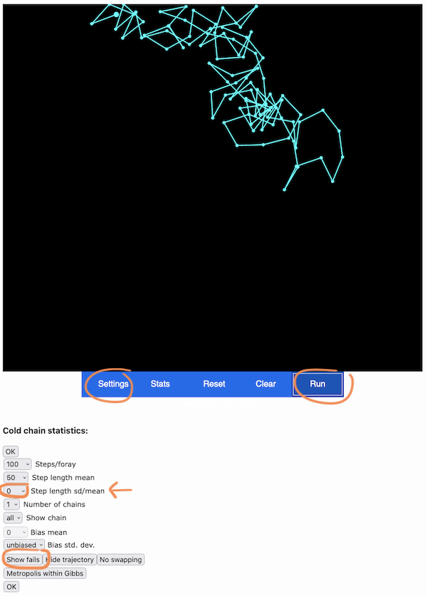
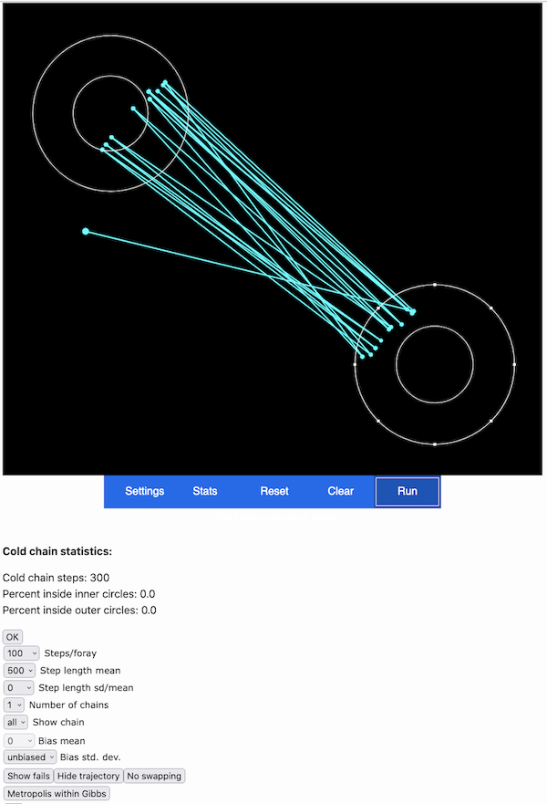

# Testing Markov chain Monte Carlo with the MCMC robot (Activity 5)

## Objective

Practice Markov chain Monte Carlo (MCMC) sampling. MCMC can be used to sample from a probability distribution. Similar to hill-climbing, the algorithm can get stuck on local optima and its success to explore the parameter space sufficiently depends on – for example – the step operator or a scale operator. 

## Table of contents

* [5.1 Flat parameter space](#flat)
* [5.2 Simple parameter space](#simple)
* [5.3 Complex parameter space](#complex)
* [Optional: other parameter settings](#mcmc_opt)

## 5.1 Flat parameter space

Go to Paul Lewis' [MCMC Robot webpage](https://plewis.github.io/applets/mcmc-robot/). If you have an iPhone or iPad, you can also download and install the free app “MCMC Robot” from the App Store (the description given below may not exactly fit the appearance in the app).

Click on the **outer white ring** in the black square and delete the “peak” (the two white rings should disappear). Then click on **Settings** in the blue menu below the black square and change "**Step length sd/mean**" from 1 to 0 and click on “**Hide fails**” to deactivate it (the button changes to "show fails"). Then click on the blue “**Run**” button to perform 100 steps of the MCMC. Continue to click the button repeatedly (10-30 times) to continue the chain.

<kbd></kbd>

 How is the parameter landscape explored (how is the distribution and step length)?

 

  
Answer (click here)
  

--------

You should see that the MCMC explores the two-dimensional parameter landscape more or less evenly, because no probability peaks have yet been defined. You should also see that all steps are equally large.

--------

Click on "**Clear**" to remove the MCMC chain. Then go back to **Settings** and change the "**Step length sd/mean**" to 10. Click on the “**Run**” button again a few times. You should see that the size of the steps now differs.

## 5.2 Simple parameter space 

Click on "**Clear**" to remove the MCMC chain. Then click somewhere in the black square and drag the mouse to define the size of a “hill” (a probability peak). By clicking inside the circle you can drag the hill to another place. The two circles of the hill represent the contours of the 95% and 50% probability mass.
Leave the other settings unchanged and click the “**Run**” button repeatedly. 

<kbd></kbd>

 How is the parameter landscape explored this time?

 

  
Answer (click here)

--------
  
You should see that the MCMC chain quickly finds the probability peak, and that it rarely leaves it afterwards.

Click on “**Stats**”. Here you should see that the number of MCMC samples inside the 50% contour is close to 50% of the total number, and that the number of samples inside the 95% contour is also close to 95%, in line with the expectation for MCMC sampling. The more steps you perform, the closer you will get to 50% and 95%, respectively. 

--------

So far, we’ve only seen lines and dots representing states that have been accepted by the MCMC algorithm (colored in blue) and that have therefore become part of the MCMC chain. Activate “**Show fails**” in the Settings menu (you may have to re-run the chain). You should now also see purple lines representing the proposed states with lower probability that have been proposed but not accepted by the MCMC algorithm. You’ll see that these purple lines seem to surround the blue ones and the probability peak. That is, because the further away these dots are from the peak, the lower is their probability, and therefore they are also less often accepted. You may see the pattern more clearly if you re-run the chain with the “Show fails” option on.

<kbd></kbd>

Click on "**Clear**" again to remove the MCMC chain. Change the **"Step length mean"** to 500 and set a standard deviation of the step size (**Step length sd/mean**) of 0.

 How do these settings affect the discovery of the probability peak by the MCMC? Why do you see this pattern?

 

  
Answer (click here)

--------
  
You should see that the MCMC has difficulties reaching the center of the probability peak, because in order to get to the peak, it would first have to be in an accepted position 150 units away from it. As a result, the MCMC chain appears to from a ring from which states further outside are proposed but almost always rejected. After clicking the “**Run**” button several times, check the “**Stats**” for this MCMC chain. You might see that much less than 50% and 95% of the samples are now found within the 50% and 95% contours, respectively. Which would demonstrate that a flexible step size is crucial for proper MCMC behaviour.

<kbd></kbd>

--------

## 5.3 Complex parameter space 

"**Clear**" the MCMC chain. Deactivate the “**Show fails**” option. Keep the large **"Step length mean"** (500) and the minimal standard deviation of the step size (0 or 1). Then, return to the black square and define a second hill that is in the opposite corner of the first hill and has a similar size to the first hill. Click the “**Run**” icon again a few times. You should see that almost all accepted steps are those that cross from one peak to the other. The areas of the individual peaks do not seem to be explored homogeneously by the MCMC chain. 

<kbd></kbd> 


Now, set the step length to more reasonable values. Use 50 for the **"Step length mean"** and 10 for the the standard deviation (**Step length sd/mean**). Then, run the MCMC chain again for a few thousand steps. You should see that even though the chain tends to remain within a peak most often, it occasionally crosses from peak to peak and is thus able to explore both evenly. If you click on the “**Stats**” button, you should see that about 50% and 95% of the accepted samples are within the 50% and 95% contours. 

Now, clear the screen and change the starting position (just by clicking once somewhere in the black square). Click on “**Run**” again a couple of times. You will see that perhaps this time the other peak is explored more thoroughly.

 Discuss with your neighbours which settings of the MCMC chain seem to be important, how the parameter landscape can influence the exploration of the MCMC chain and why different starting positions are important.

## Optional: other parameter settings

Explore the MCMC robot a bit more. For example, add further hills, have a low (small) and high (large) hill, add an additional chain. There are also more options in the app.

 