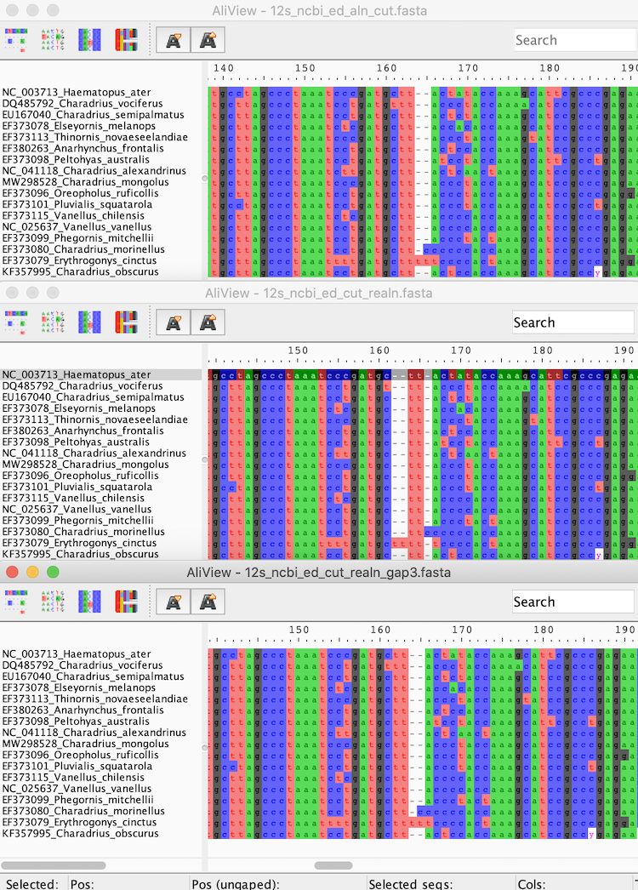
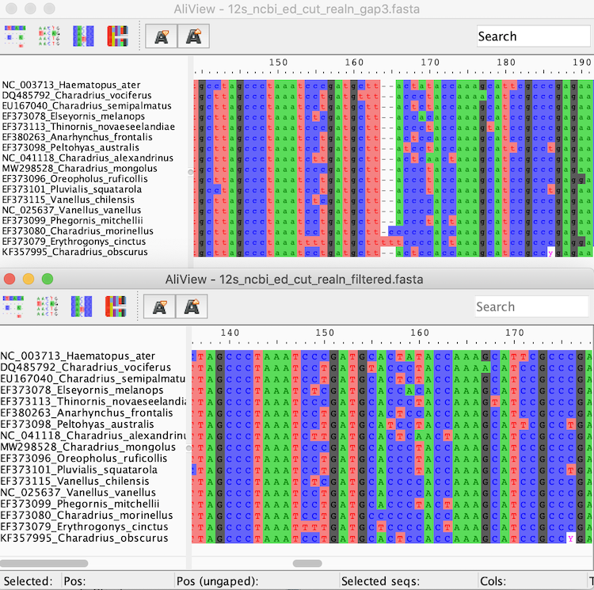
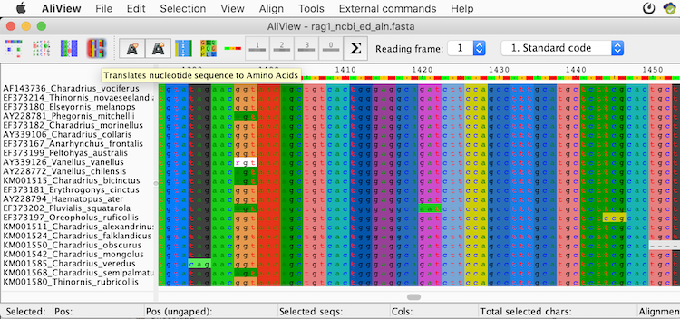

# Multiple Sequence Alignment (Activity 2)

## Objective

Learn how to generate a multiple sequence alignment (MSA) and how to improve poorly aligned regions.
In [Activity 1](../dataset_compilation/README.md), we learned how to retrieve homologous sequences – the prerequisite to proceed to alignments – and how to prepare our dataset for analyses. In this second activity, we will align these sequences to trace the evolutionary past by matching similar regions that may share an evolutionary history.

## Table of contents

* [2.1 Align the 12s sequences using MAFFT](#mafft)
* [2.2 Edit the alignment in an alignment viewer](#aliview)
* [2.3 Re-align the alignment](#realign)
* [2.4 Exclude unreliably aligned regions](#bmge)
* [2.5 Generate an alignment of conserved coding sequences, identify its correct reading frame, and use this information to improve the alignment](#rag1_aln)  

## 2.1 Align the 12s sequences using MAFFT

Go to the [MAFFT alignment server](https://mafft.cbrc.jp/alignment/server/). This site provides a web interface to the MAFFT alignment program ([Katoh et al. 2002 Nucleic Acids Res](https://doi.org/10.1093/nar/gkf436)), a popular multiple sequence aligner that implements progressive and iterative methods and both the Needleman-Wunsch and Smith-Waterman global and local alignment algorithms.

  
Optional: Download and locally install MAFFT (click here)

--------

In case the web server is busy or you plan to use MAFFT for your future own work, you may also download and install the [MAFFT software (Standard package)](https://mafft.cbrc.jp/alignment/software/) locally on your computer.

--------

Upload the file [`12s_ncbi_ed.fasta`](../dataset_compilation/res/12s_ncbi_ed.fasta) that we produced in [Activity 1](../dataset_compilation/README.md) to the “**Input**” field of the MAFFT website (using the "Browse" button to upload a plain text file). Leave all settings at their defaults to use the “Auto” strategy, and click “**Submit**” to send your sequences for alignment.

  
Optional: Command for locally installed MAFFT (click here)

--------

If you use MAFFT on your computer, type the following (replace PATH/TO with the correct path and NUMBER with the number of threads/CPUs you want to use): 
`PATH/TO/mafft --auto --thread NUMBER --reorder /PATH/TO/12s_ncbi_ed.fasta > /PATH/TO/12s_ncbi_ed_aln.fasta`
Here, the output will be a FASTA format that can be inspected using the Terminal, a text editor, or an alignment viewer.

--------

 After less than a minute, the alignment should be ready and a new page will open that shows the alignment in CLUSTAL format. Inspect the output. Are all sequences nicely aligned in one block? If not, what could be the reason? Discuss with your neighbors.

  
Discussion points (click here)

  
 --------
 
   * Length of the 12s sequence
   * "NC" sequences

 --------
 

 Can you find out which of the MAFFT alignment algorithms (progressive/iterative, local/global/FFT) has been used?

  
Answer (click here)

--------

All the way at the bottom of the output the used method is indicated: "FFT-NS-2 (Fast but rough)". Below is a list of publications describing the algorithmns, but there is also a [MAFFT website explaining the algorithmns and parameters](https://mafft.cbrc.jp/alignment/software/algorithms/algorithms.html).

In FFT-NS-2, the fast Fourier transform (FFT) algorithm (hence MAFFT for **M**ultiple **A**lignment using **F**ast **F**ourier **T**ransform!) is used to perform a 2-step progressive alignment where the sequences are re-aligned along the guide tree inferred from the alignment by FFT-NS-1. It is expected that the re-alignment produces a more reliable alignment compared to only one round of progressive alignment (FFT-NS-1); however, the algorithm is not as accurate as the full iterative refinement methods (FFT-NS-i).

--------

Download the alignment in FASTA format to your computer. To do so, click the link “**Fasta format**” at the very top of the page. Rename the file `12s_ncbi_ed_aln.fasta` and save it in your working directory.

## 2.2 Edit the alignment in an alignment viewer

Download the [AliView alignment viewer](http://ormbunkar.se/aliview) ([Larsson 2014 Bioinf](https://doi.org/10.1093/bioinformatics/btu531)) and install the program (v1.28 Mac, Linux, and Windows versions available).

Open the file that we just produced with MAFFT ([`12s_ncbi_ed_aln.fasta`](res/12s_ncbi_ed_aln.fasta)) in AliView. Use the slider at the bottom to inspect the alignment from left to right. 

Since whole-mitochondrial genome sequences are only available for a few species, these do not help us much and we can remove the exceeding sequence parts not corresponding to the 12s region (the compact alignment block from about position 407-971).  
Use the mouse and key-combination function(fn)-shift (instead of scrolling!) to select the sequences of all species from position 1 to about position 406, just before the well-aligned block starts (the exact position may vary due to the progressive method not finding the absolute best alignment in some cases).  
Press shift and hit the back-space (“delete”) key or go to the menu: Edit > “Delete selected”. In the pop-up window, allow for edits and click OK to clear all selected positions. Repeat this procedure for the exceeding sequence part from about position 566 all the way to the end.  
Save the edited file: go to the menu > **File** > “**Save as Fasta**” and save the file using the name ([`12s_ncbi_ed_aln_cut.fasta`](res/12s_ncbi_ed_aln_cut.fasta)).

## 2.3 Re-align the alignment

Go again to the [MAFFT alignment server](https://mafft.cbrc.jp/alignment/server/) or use MAFFT on your computer. Upload and align the length-reduced 12s file ([`12s_ncbi_ed_aln_cut.fasta`](res/12s_ncbi_ed_aln_cut.fasta)) using again the “Auto” strategy, but check the box for “**Output order: Same as input**”. 

  
Optional: Command for locally installed MAFFT (click here)

--------

Using MAFFT on your computer, replace `--reorder` with `—inputorder`.

--------

 Was the alignment procedure faster? Which of the MAFFT alignment algorithms (progressive/iterative, local/global/FFT) was used this time?

  
Answer (click here)

--------

The procedure shoud have been much faster. The reduced alignment length also reduced the computational time needed to perform the alignment. The algorithm used was the **L-INS-i (Probably most accurate, very slow)**, an iterative refinement method using the local Smith-Waterman algorithm. This will lead to a precise core alignment with potentially unaligned flanking regions.

--------

Download the alignment again in FASTA format by clicking the link “**Fasta format**” at the top of the page. Rename the file to `12s_ncbi_ed_cut_realn.fasta`. 

Without closing the previous AliView window, open the new re-aligned file ([`12s_ncbi_ed_cut_realn.fasta`](res/12s_ncbi_ed_cut_realn.fasta)) in a separate AliView window. 

 Compare the total alignment lengths shown in the status bar at the bottom right. Which alignment is longer? Scroll through both alignments and try to spot the main differences. Which are these? 

  
Answer (click here)

--------

The re-aligned version is longer by one position (566 positions). The reason is an additional gap at position 158 in the re-aligned alignment. This may or may not make sense. If your expectation is that your sequences are highly conserved, you may increase the penalty for opening gaps (see next paragraph).

--------



Go back to the previous result in the MAFFT alignment server. You may press “go back one page” in your browser to return to the input page with your alignment file still loaded. Scroll down to see the search parameters and change the “**Gap opening penalty**” from the default value of 1.53 to 3.

  
Optional: Command for locally installed MAFFT (click here)

--------

Using MAFFT on your computer, add `--op 3.0` to your command line.

--------

Submit the sequences and download the result in FASTA format. Rename the file to [`12s_ncbi_ed_cut_realn_gap3.fasta`](res/12s_ncbi_ed_cut_realn_gap3.fasta) and open it in AliView alongside the two other alignments. If your computer screen is too small to view all alignments at once, you can either decrease the font size by pressing the little “A” in the menu-bar and/or close the first ([`12s_ncbi_ed_cut.fasta`](res/12s_ncbi_ed_cut.fasta)) alignment.

 How long is the new alignment? Has the additional gap disappeared? What else has changed?

  
Answer (click here)

--------

The new alignment with the increased gap penalty is shorter than the other two with only 564 positions. The additional gap at position 158 has disappeared. Also, two more gaps between positions ~444 and ~454 have now been merged to one gap.

<kbd></kbd>

--------

## 2.4 Exclude unreliably aligned regions 

By comparing the alignments above, you may have realized that despite the different algorithms and parameters used, alignment differences were always located in the same regions, while other parts did not change. This is, because some parts of the sequence are more conserved among the species and can thus be aligned with greater confidence. For phylogenetic inference, we rely on aligning only homologous sites, so we may exclude variable non-conserved regions that cannot be aligned with high confidence.

We will use the software BMGE (Block Mapping and Gathering with Entropy by [Criscuolo & Gribaldo 2010 BMC Evol Biol](https://doi.org/10.1186/1471-2148-10-210)) for this purpose. Download BMGE using the command below in your Terminal: 

`curl ftp://ftp.pasteur.fr/pub/gensoft/projects/BMGE/BMGE-1.12.tar.gz -o BMGE-1.12.tar.gz`

Extract the content of the compressed tar.gz file using:

`tar xvzf BMGE-1.12.tar.gz `

Change the directory to the BMGE folder and test the program:

`cd BMGE-1.12`  
`java -jar BMGE.jar `

If you see a line starting with `mandatory parameters: -i ‘infile’…` the software works and you can type the following command to take the cut and re-aligned FASTA file as input.

`java -jar BMGE.jar -i PATH/TO/12s_ncbi_ed_cut_realn.fasta -t DNA -of PATH/TO/12s_ncbi_ed_cut_realn_filtered.fasta -oh PATH/TO/12s_ncbi_ed_cut_realn_filtered.html`

The `-t` flag indicates that we are using DNA sequences, `-of` tells the program to write a filtered alignment in FASTA format, and `-oh` to visualize the filtered alignment in HTML format.

Open the output file [`12s_ncbi_ed_cut_realn_filtered.html`](./res/https://htmlpreview.github.io/?https://github.com/JMIBarth/tutorials/blob/main/multiple_sequence_alignment/res/12s_ncbi_ed_cut_realn_filtered.html) in your browser. Scroll through the alignment and note the black alignment blocks. At the very top of the alignment, you’ll see two measures plotted for each site in light grey and black.
 
The **gap proportion** is shown with **light gray equal signs** and ranges from 0 to 1. **Black colons** indicate what is called a “**smoothed entropy-like score**”. Basically, this is a measure of the nucleotide diversity at this site. 
You’ll note that the black alignment blocks coincide with regions of low gap proportion and low entropy, which are the most suitable alignment positions for phylogenetic inference. Our selection of alignment blocks is based on default settings of BMGE for the entropy score cut-off (option `-h`), the gap-rate cut-off (`-g`), and the minimum block size (`-b`). By default, BMGE selects sites with an entropy score below 0.5 (`-h 0.5`) and a gap proportion below 0.2 (`-g 0.2`), and only if these form a block of at least 5 sites with these properties (`-b 5`). The standard output of BMGE to the terminal tells you how many sites (characters) remain selected. 

Now, open the file [`12s_ncbi_ed_cut_realn_filtered.fasta`](res/12s_ncbi_ed_cut_realn_filtered.fasta) in AliView.  

 Does the BMGE filtered alignment look better? What has changed? 

  
Answer (click here)

--------

Yes, it is now shorter and appears much more condensed than the previous alignment. The large gaps have been removed.

<kbd></kbd>

--------

 
Save the file in Phylip format as `12s_ncbi_ed_cut_realn_filtered.phy`, using the “**Save as Phylip (full names & padded)**” option in AliView’s “**File**” menu. Also save the file in Nexus format with the “**Save as Nexus**” option as `12s_ncbi_ed_cut_realn_filtered.nex`. 

Open the Phylip and Nexus files in a text editor to see the differences between the file formats.

  
(Optional) Repeat the BMGE block selection with custom settings (click here)

--------

You may want to use a more stringent or more relaxed filtering to filter for more conserved regions or to keep a longer alignment, respectively. Therefore, repeat the BMGE block selection with custom settings for entropy-score cut-off, gap-rate cut-off, and minimum block size, and note how this changes the overall number of selected sites and the distribution of selected blocks in the alignment. For example, increase the allowed proportion of gaps using `-g 0.3`: 


`java -jar BMGE.jar -i PATH/TO/12s_ncbi_ed_cut_realn.fasta -t DNA -g 0.3 -of PATH/TO/12s_ncbi_ed_cut_realn_filtered.fasta -oh PATH/TO/12s_ncbi_ed_cut_realn_filtered.html`

--------

## Generate an alignment of conserved coding sequences, identify its correct reading frame, and use this information to improve the alignment 

Above, we aligned the mitochondrial 12s ribosomal RNA gene, which is not translated into proteins. Here we will now align the nuclear rag1 gene, which encodes a protein of a complex involved in antibody receptor recombination and can thus be translated into a protein sequence to guide our alignment.

Upload the file [`rag1_ncbi_ed.fasta`](../dataset_compilation/res/rag1_ncbi_ed.fasta) to the [MAFFT alignment server](https://mafft.cbrc.jp/alignment/server/). Keep all options at their defaults and click the “**Submit**” button. 

 Which of MAFFT’s algorithms was used this time? 

  
Answer (click here)

--------

L-INS-i was used again. 

--------

Download the alignment in FASTA format to your computer. Name the file`rag1_ncbi_ed_aln.fasta`. Keep the MAFFT website open, we will need it later again.

Open the file [`rag1_ncbi_ed_aln.fasta`](res/rag1_ncbi_ed_aln.fasta) in AliView. 

 What are the obvious differences to the previous 12s alignment? Discuss with your neighbours why the rag1 alignment looks “better” aligned compared to the 12s alignment.

  
Discussion points (click here)

--------

* gaps, substitutions
* conserved regions
* essential genes
* selection
* mutation rate

--------

In Aliview, click on the fourth icon from the left in the tool bar to translate the nucleotide sequence to amino acids.

<kbd></kbd> 

Next, click the "**sigma-sign icon**" (Σ) in the center of the tool bar to count stop codons.  
 How many stop codons does AliView count? 

  
Answer (click here)

--------

1098 

--------

Change the reading frame using the drop-down menu to the right of the sigma-sign icon and also count stop codons for the **second** and the **third reading frame**. Note how the overall color pattern of the alignment changes when you select different reading frames. 

 Does one reading frame appear more conserved than the other two? Which reading frame has the lowest number of stop codons? Use the reading frame with the lowest stop codon number from now on.

  
Answer (click here)

--------

1. 1098
2. 0
3. 910 

--------

Notice that from position 1247 to 1273, there is a large indel. Could this indicate that these species are more closely related compared to the other species? To test this assumption, go back to the MAFFT website with the rag1 alignment. Click on “**Phylogenetic tree**” in the options above the alignment. Keep the default options and click “**Go!**”. Then choose “**View tree on Phylo.io**” and re-root the tree by clicking on the branch of the outgroup species (*Haematopus ater*) and selecting “**reroot**”. 

 Inspect the tree. Are the species with the indels forming a clade? 

  
Answer (click here)

--------

No, they occur in three different clades, indicating that the remaining rag1 sequence among those species is more diverged and implying that the indel must have evolved convergently.

--------

 Go back to the alignment, do you notice something odd with this region? This 27 bp indel region seems to be exactly the same as the 27 bp region to the right. If we look closely, we even find one substitution that is exactly the same. Also, all the UID accession numbers begin with the same letter and number combination, indicating that these originate from the same study. What do you think could have happened here? Discuss with your neighbors. 

  
Discussion points (click here)

--------

* technical error
* sequencing artifact
* false combination of the sequences from the forward and reverse primers

--------

The example above discloses the limits of automated sequence alignment and whatever sequences you have, whatever alignment method you choose – always manually inspect your alignments. Poor alignment can result in falsely inferred substitutions, eventually leading to a wrong phylogeny, following the maxim: "Rubbish in, rubbish out".

So, whatever caused the indel, we do not trust this region and delete the whole region like we did before. In addition, shorten the alignment by removing the not very informative beginning of the alignment where only few species have data (about position 0 to 130). Check again that our editing has not introduced an alignment error by counting the stop codons (you may have to adjust the reading frame again).

Save the alignment in Fasta format using the name [`rag1_ncbi_ed_aln_filtered.fasta`](res/rag1_ncbi_ed_aln_filtered.fasta).
