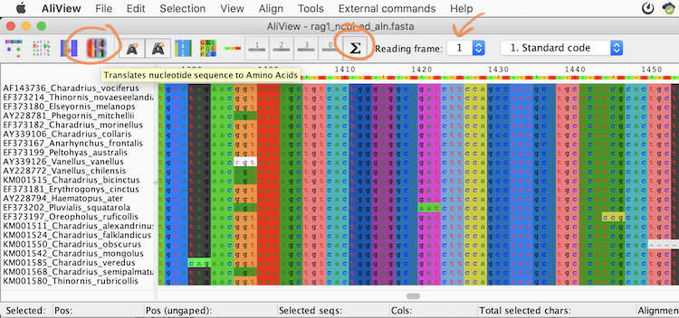

# Multiple Sequence Alignment (Activity 2)

## Objective

Learn to generate a multiple sequence alignment (MSA) and refine poorly aligned regions.
In [Activity 1](../dataset_compilation/README.md), we learned how to retrieve homologous sequences and how to prepare the dataset. In this activity, we will align the sequences to trace the evolutionary past by matching similar regions that share an evolutionary history.

## Table of contents

* [2.1 Align the 12s sequences using MAFFT](#mafft)
* [2.2 Edit the alignment in an alignment viewer](#aliview)
* [2.3 Re-align the alignment](#realign)
* [2.4 Exclude unreliably aligned regions](#bmge)
* [2.5 Generating and refining an alignment of conserved coding sequences](#rag1_aln)  

## 2.1 Align the 12s sequences using MAFFT

Go to the [MAFFT alignment web interface](https://mafft.cbrc.jp/alignment/server/). This site provides an easy-to-use interface for aligning multiple sequences using MAFFT ([Katoh et al. 2002 Nucleic Acids Res](https://doi.org/10.1093/nar/gkf436)). It supports various alignment methods such as progressive and iterative alignment, and different global and local algorithms like Needleman-Wunsch and Smith-Waterman.

  
Optional: Download and locally install MAFFT (click here)

--------

If the MAFFT web server is busy or you plan to use MAFFT for your own future work, you can download and install the MAFFT software (Standard package) locally [MAFFT software (Standard package)](https://mafft.cbrc.jp/alignment/software/).

--------

Upload the [`12s_ncbi_ed.fasta`](../dataset_compilation/res/12s_ncbi_ed.fasta) file from [Activity 1](../dataset_compilation/README.md) to the “**Input**” field of the MAFFT website using the "Browse" button. Leave the settings at their default “Auto” strategy, and click “**Submit**” to align the sequences.

  
Optional: Command for locally installed MAFFT (click here)

--------

For locally installed MAFFT, enter the following in the Terminal (replace PATH/TO with the correct path and NUMBER with the number of threads/CPUs you want to use): 
`PATH/TO/mafft --auto --thread NUMBER --reorder /PATH/TO/12s_ncbi_ed.fasta > /PATH/TO/12s_ncbi_ed_aln.fasta`
The output is a FASTA file that can be inspected using the Terminal, a text editor, or an alignment viewer.

--------

<kbd></kbd>

 In less than a minute, the alignment should appear in CLUSTAL format. Inspect the alignment. Are all sequences aligned in one block? If not, what could be the reason? Discuss with your neighbors.

  
Discussion points (click here)

  
 --------
 
   * Length of the 12s sequence
   * "NC" sequences

 --------
 

 Which of the MAFFT alignment algorithms (progressive/iterative, local/global/FFT) was used?

  
Answer (click here)

--------

Just above and at the very end of the alignment the method is indicated: "FFT-NS-2 (Fast but rough)". Below the alignment there is also a list of publications describing the algorithmns. Importantly, a [MAFFT website explaining the algorithmns and parameters and their abbreviations](https://mafft.cbrc.jp/alignment/software/algorithms/algorithms.html) also exists.

In FFT-NS-2, the fast Fourier transform (FFT) algorithm (hence MAFFT for **M**ultiple **A**lignment using **F**ast **F**ourier **T**ransform) is used to perform a 2-step progressive alignment where the sequences are re-aligned along the guide tree inferred from the alignment by FFT-NS-1. It is expected that the re-alignment produces a more reliable alignment compared to only one round of progressive alignment (FFT-NS-1); however, the algorithm is not as accurate as the full iterative refinement methods (FFT-NS-i).

--------

Download the alignment in FASTA format by clicking “**Fasta format**” at the top of the page. Rename the file `12s_ncbi_ed_aln.fasta` and save it in your working directory.

<kbd></kbd>

## 2.2 Edit the alignment in an alignment viewer

If not already done, download and install the [AliView alignment viewer](http://ormbunkar.se/aliview) ([Larsson 2014 Bioinf](https://doi.org/10.1093/bioinformatics/btu531)).

Open the MAFFT produced file ([`12s_ncbi_ed_aln.fasta`](res/12s_ncbi_ed_aln.fasta)) in AliView (use "File" > "Open file" if it doesn't open automatically). Use the bottom slider to inspect the alignment from left to right. 

To remove the whole-mitochondrial genome sequences outside the 12s region (the compact alignment block from about position 407-971), click on position 1 in the scale bar above the alignment. Then, use the slider to navigate to around position 406 (the exact position may vary due to the progressive method not finding the absolute best alignment in some cases). Hold the `fn`+`shift` keys (or the equivalent key combination on your computer) and click at position 406, just before the well-aligned block. This should highlight positions 1 to about 406 in all sequences.

<kbd></kbd>

Press `shift` (or `command`) and hit the `back-space` (“delete”) key, or go to the menu: Edit > “**Delete selected**”, to remove the selected positions. In the pop-up window, allow for edits and click OK to clear all selected positions. 

Repeat this procedure for the exceeding sequence part from about position 566 to the end.  

Save the edited file: go to the menu > **File** > “**Save as Fasta**” and save the file using the name ([`12s_ncbi_ed_aln_cut.fasta`](res/12s_ncbi_ed_aln_cut.fasta)).

## 2.3 Re-align the alignment

Go to the [MAFFT alignment server](https://mafft.cbrc.jp/alignment/server/) or use MAFFT on your computer. Upload the length-reduced 12s file ([`12s_ncbi_ed_aln_cut.fasta`](res/12s_ncbi_ed_aln_cut.fasta)), use the “Auto” strategy, and check the box for “**Output order: Same as input**” before submitting the alignment.

  
Optional: Command for locally installed MAFFT (click here)

--------

Using MAFFT on your computer, replace `--reorder` with `--inputorder`.

--------

 Was the alignment procedure faster? Which of the MAFFT alignment algorithms (progressive/iterative, local/global/FFT) was used this time?

  
Answer (click here)

--------

The procedure should have been much faster due to the reduced alignment length, which decreased the computational time. The algorithm used was **L-INS-i (Probably most accurate, very slow)**, an iterative refinement method utilizing the local Smith-Waterman algorithm. This results in a precise core alignment, though some flanking regions may remain unaligned.

--------

Download the alignment in FASTA format by clicking “**Fasta format**” at the top of the page. Rename the file to `12s_ncbi_ed_cut_realn.fasta`. 

Without closing the previous AliView window, open the new re-aligned file ([`12s_ncbi_ed_cut_realn.fasta`](res/12s_ncbi_ed_cut_realn.fasta)) in a new AliView window. 

 Compare the total alignment lengths shown in the status bar at the bottom right. Which alignment is longer? Scroll through both alignments and try to spot the main differences. Which are these? 

  
Answer (click here)

--------

The re-aligned version is longer by one position (566 positions). The reason is an additional gap at position 158 in the re-aligned alignment. This may or may not make sense. If your expectation is that your sequences are highly conserved, you may increase the penalty for opening gaps to prevent additional gaps to be introduced (see next paragraph).

--------



To modify the settings in the MAFFT alignment server, go back to the previous result by pressing "go back one page" in your browser. Once on the input page, scroll down to the "Advanced settings" section. Change the “**Gap opening penalty**” from the default value of 1.53 to 3.

  
Optional: Command for locally installed MAFFT (click here)

--------

Using MAFFT on your computer, add `--op 3.0` to your command line.

--------

Submit the sequences with the updated gap opening penalty and download the result in FASTA format. Rename the file to [`12s_ncbi_ed_cut_realn_gap3.fasta`](res/12s_ncbi_ed_cut_realn_gap3.fasta) and open it in AliView alongside the two other alignments. If the screen is too small to view all alignments at once, either decrease the font size by clicking the small “A” in the menu-bar or close the first alignment ([`12s_ncbi_ed_cut.fasta`](res/12s_ncbi_ed_cut.fasta)).

 How long is the new alignment? Has the additional gap disappeared? What else has changed?

  
Answer (click here)

--------

The new alignment with the increased gap penalty is shorter than the other two with only 564 positions. The additional gap at position 158 has disappeared. Also, two more gaps between positions ~444 and ~454 have now been merged to one gap.

<kbd></kbd>

--------

## 2.4 Exclude unreliably aligned regions 

By comparing the alignments, you may have noticed that despite using different algorithms and parameters, the differences in the alignments always occurred in the same regions, while other parts remained consistent. This is because some parts of the sequence are more conserved among species, allowing for more reliable alignment. For phylogenetic inference, we rely on aligning only homologous sites, so we may exclude variable, non-conserved regions that cannot be aligned with confidently.

We will use the software BMGE (Block Mapping and Gathering with Entropy by [Criscuolo & Gribaldo 2010 BMC Evol Biol](https://doi.org/10.1186/1471-2148-10-210)) for this purpose. 

  
If you haven't downloaded BMGE (click here)

--------

Download BMGE by executing: 
`curl ftp://ftp.pasteur.fr/pub/gensoft/projects/BMGE/BMGE-1.12.tar.gz -o BMGE-1.12.tar.gz` in your Terminal.

Extract the content of the compressed tar.gz file using:
`tar xvzf BMGE-1.12.tar.gz `

Change the directory to the BMGE folder and test the program:
`cd BMGE-1.12`  
`java -jar BMGE.jar `

If you see a line starting with `mandatory parameters: -i ‘infile’…` the software works.

--------

To execute BMGE in the Terminal, use the following command. Replace PATH/TO/ with the path to the directory where you saved BMGE, or navigate to the directory where you saved the program and run the command from there:
`java -jar PATH/TO/BMGE.jar -i PATH/TO/12s_ncbi_ed_cut_realn.fasta -t DNA -of PATH/TO/12s_ncbi_ed_cut_realn_filtered.fasta -oh PATH/TO/12s_ncbi_ed_cut_realn_filtered.html`

The `-t` flag indicates that we are using DNA sequences, `-of` tells the program to write a filtered alignment in FASTA format, and `-oh` to visualize the filtered alignment in HTML format.

Open the output file [`12s_ncbi_ed_cut_realn_filtered.html`](https://htmlpreview.github.io/?https://github.com/JMIBarth/tutorials/blob/main/multiple_sequence_alignment/res/12s_ncbi_ed_cut_realn_filtered.html) in your browser. Scroll through the alignment and note the black alignment blocks. At the very top of the alignment, you’ll see two measures plotted for each site in light grey and black. The **gap proportion** is presented by **light gray equal signs** and ranges from 0 to 1, while **black colons** indicate what is called a “**smoothed entropy-like score**”, which measure nucleotide diversity at each site. The black alignment blocks coincide with regions of low gap proportion and low entropy, which are the most suitable alignment positions for phylogenetic inference. By default, BMGE selects sites with an entropy score below 0.5 (`-h 0.5`) and a gap proportion below 0.2 (`-g 0.2`), and only if these form a block of at least 5 sites with these properties (`-b 5`). The BMGE output in the terminal identifies how many sites remain after applying these filters.

<kbd></kbd>

 How many sites were selected as reliably aligned and how many excluded by BMGE? 

  
Answer (click here)

--------

541 were selected as reliably aligned, only 25 were removed.

--------

Open the file [`12s_ncbi_ed_cut_realn_filtered.fasta`](res/12s_ncbi_ed_cut_realn_filtered.fasta) in AliView.  

 Does the BMGE filtered alignment look better? What has changed? 

  
Answer (click here)

--------

Yes, it is now shorter and appears much more condensed than the previous alignment. The large gaps have been removed.

<kbd></kbd>

--------

 
Save the file in Phylip format as `12s_ncbi_ed_cut_realn_filtered.phy`, using the “**Save as Phylip (full names & padded)**” option in AliView’s “**File**” menu. Then, save the file in Nexus format using the “**Save as Nexus**” option as `12s_ncbi_ed_cut_realn_filtered.nex`.  

Open both files in a text editor to see the differences between the file formats.

  
(Optional) Repeat the BMGE block selection with custom settings (click here)

--------

To adjust the filtering stringency, repeat the BMGE block selection with custom settings for entropy-score cut-off, gap-rate cut-off, and minimum block size. Observe how these changes affect the number of selected sites and the distribution of conserved blocks. For example, to allow a higher proportion of gaps, use the option `-g 0.3`.

`java -jar BMGE.jar -i PATH/TO/12s_ncbi_ed_cut_realn.fasta -t DNA -g 0.3 -of PATH/TO/12s_ncbi_ed_cut_realn_filtered.fasta -oh PATH/TO/12s_ncbi_ed_cut_realn_filtered.html`

--------

## 2.5 Generating and refining an alignment of conserved coding sequences

Previously, we aligned the mitochondrial 12s ribosomal RNA gene, a non-coding region not translated into proteins. Now, we will align the nuclear rag1 gene, which encodes a protein involved in antibody receptor recombination. This allows us to use its translated protein sequence to guide and improve the alignment accuracy.

Upload the file [`rag1_ncbi_ed.fasta`](../dataset_compilation/res/rag1_ncbi_ed.fasta) to the [MAFFT alignment server](https://mafft.cbrc.jp/alignment/server/). Keep all options at their defaults and click the “**Submit**” button. 

 Which of MAFFT’s algorithms was used this time? 

  
Answer (click here)

--------

L-INS-i was used again. 

--------

Download the alignment in FASTA format and name the file`rag1_ncbi_ed_aln.fasta`. Keep the MAFFT website with the rag1 results open, we will need it later again.

Open the file [`rag1_ncbi_ed_aln.fasta`](res/rag1_ncbi_ed_aln.fasta) in AliView. 

 What differences do you notice compared to the 12s alignment? Discuss with your neighbours why the rag1 alignment appears “better” aligned.

  
Discussion points (click here)

--------

* gaps, substitutions
* conserved regions
* essential genes
* selection
* mutation rate

--------

In Aliview, click on the fourth icon from the left in the tool bar to translate the nucleotide sequence to amino acids. Next, click the "**sigma-sign icon**" (Σ) in the center of the tool bar to count stop codons.  

<kbd></kbd> 

 How many stop codons are counted? 

  
Answer (click here)

--------

1098 

--------

Change the reading frame using the drop-down menu next to the sigma icon and count stop codons for the **second** and **third reading frames**, noting how the alignment's color pattern changes.

 Which reading frame is most conserved and has the fewest stop codons? Use that frame moving forward.

  
Answer (click here)

--------

1. 1098
2. 0
3. 910 

--------

From position 1247 to 1273, a large indel (insertion/deletion) appears. Could this suggest closer relationships among some species? To explore, return to the MAFFT alignment page, click “**Phylogenetic tree**,” keep default options, and click “**Go!**”. Choose "**View the tree on Phylo.io**", re-rooting it by selecting the branch of the outgroup (*Haematopus ater*) and clicking “**reroot**.”

 Inspect the tree. Are the species with the same indel forming a clade? 

  
Answer (click here)

--------

No, the species with the indel occur in three separate clades, suggesting that their rag1 sequences are more diverged. This implies the indel evolved convergently — a rare but not impossible event, but rather unlikely.

<kbd></kbd>

--------

 Return to the alignment and examine the 27 bp indel region closely. Notice it is identical to the 27 bp region on the right, with even one matching substitution. Additionally, all UID accession numbers share the same starting letter and number combination, suggesting they come from the same study. What might have caused this? Discuss with your neighbors.

  
Discussion points (click here)

--------

* technical error
* sequencing artifact
* false combination of the sequences from the forward and reverse primers

--------

The example above discloses the **limitations** of automated sequence alignment. Regardless of the sequences or method used, **ALWAYS** manually inspect alignments to avoid errors. Poor alignments can falsely infer substitutions, leading to incorrect phylogenies — remember: "Rubbish in, rubbish out."

Due to the questionable indel region, delete it entirely as before. Additionally, remove the uninformative start of the alignment (approximately positions 0–130) where data is sparse. Finally, verify that your edits have not introduced alignment errors by recounting stop codons, adjusting the reading frame if necessary.

Save the alignment in Fasta format using the name [`rag1_ncbi_ed_aln_filtered.fasta`](res/rag1_ncbi_ed_aln_filtered.fasta).
