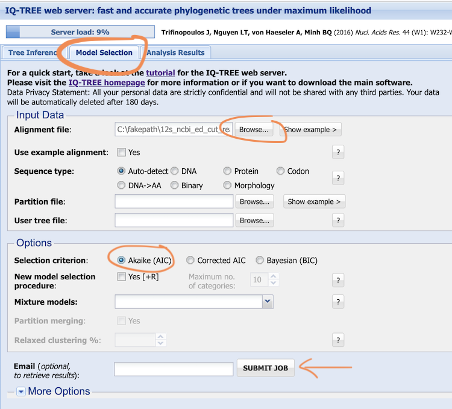
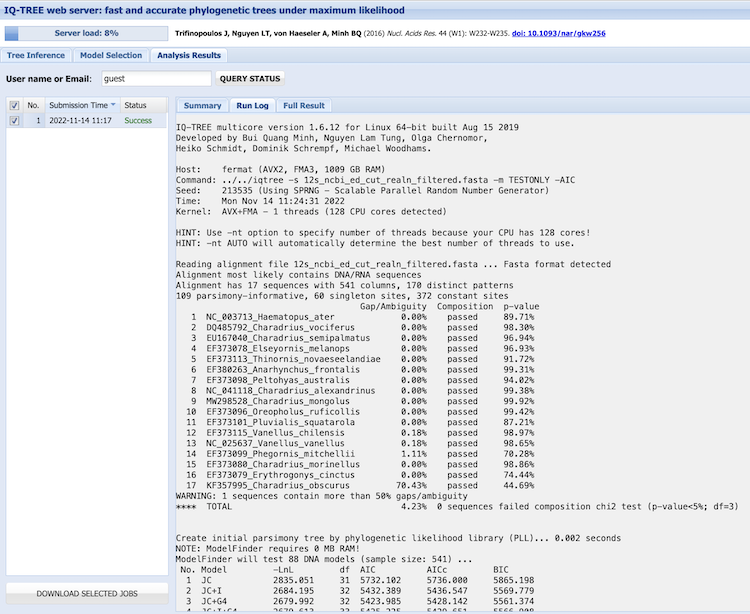
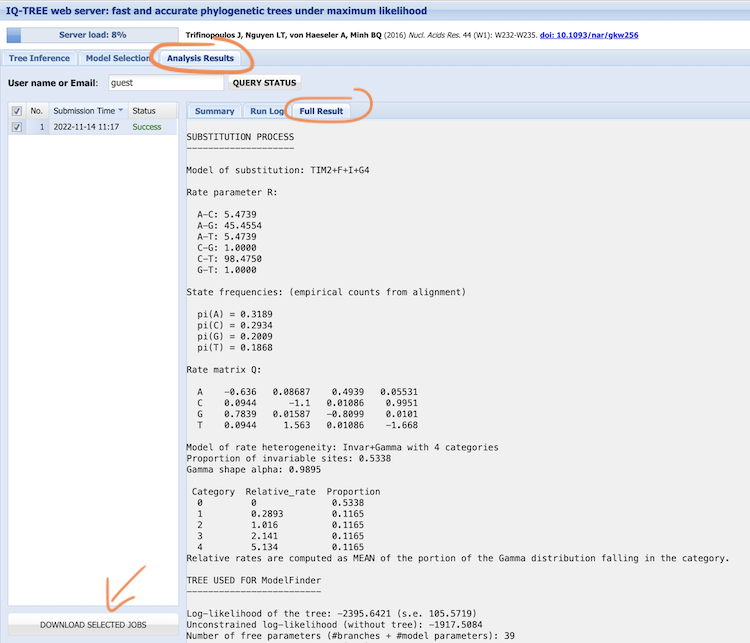

# Substitution Model Selection (Activity 3)

## Objective

Perform selection of the best-fit substitution model for phylogenetic inference.  In [Activity 1](../dataset_compilation/README.md), we learned how to retrieve homologous sequences, and in [Activity 2](../multiple_sequence_alignment/README.md) we aligned these sequences to match homologous sites. In this activity, we will select an appropriate substitution model using maximum likelihood (ML) inference.
 

## Table of contents

* [3.1 Run model selection for the 12s alignment](#model_12s)
* [3.2 Inspect the model selection log file](#log_12s)
* [3.3 Inspect the model selection results file](#results_12s)
* [(Optional) Run model selection for the CO1 and RAG1 alignments](#model_co1_rag)


<a name="model_12s"></a>
## 3.1 Run model selection for the 12s alignment

 <details>
  <summary>Background: Maximum likelihood inference software (click here)</summary>  
  
--------

One of the earliest programs for phylogenetic analysis is the software [PAUP*](http://phylosolutions.com/paup-test/) by Dave Swofford that you used on the first course day. It was developed in the late 80s and has traditionally been one of the most frequently used and cited phylogenetic programs. However, the continuous advancing of sequencing technologies has led to a massive growth of datasets, promoting the development of newer and faster tools for phylogenetic inference. These include for example: [PhyML](http://atgc.lirmm.fr/phyml) ([Guindon and Gascuel, 2003](https://doi.org/10.1080/10635150390235520)) and [RAxML](https://cme.h-its.org/exelixis/web/software/raxml/index.html) ([Stamatakis, 2006](https://doi.org/10.1093/bioinformatics/btl446)).  

In this Activity, we will make use of one of the latest of these developments, the software [IQ-TREE](http://iqtree.cibiv.univie.ac.at) ([Nguyen et al., 2015](https://doi.org/10.1093/molbev/msu300)). IQ-TREE takes advantage of an optimized implementation of the likelihood functions for better computational efficiency while yielding comparable or even better phylogenetic estimations. All programs listed above are also available on web-servers, but only PhyML and IQ-TREE include an automated substitution-model selection step, using SMS ([Lefort et al., 2017](https://doi.org/10.1093/molbev/msx149)) and ModelFinder ([Kalyaanamoorthy et al., 2017](https://doi.org/10.1038/nmeth.4285)), respectively. Finally, for IQ-TREE a very detailed and user-friendly [manual](http://www.iqtree.org/doc/) is available. 

--------
</details>

In the lecture, we discussed different evolutionary models that may be more or less suitable for our dataset at hand: different base frequencies, varying rates of substitution (for example between transitions and transversions), and rate variation among sites. Combining these parameters, a plethora of evolutionary models can be obtained (in IQ-TREE’s ModelFinder, 88 models of sequence evolution are tested against each other!).

Go to the [IQ-TREE web server](http://iqtree.cibiv.univie.ac.at). This site provides a web interface for ML inference including the most frequently used features of IQ-TREE. 

 <details>
  <summary>Optional: Download and locally install IQ-TREE (click here)</summary>  
  
--------

In case the web server is busy or you plan to use IQ-TREE for your future own work, you may also download and locally install [IQ-TREE (version 1.6.12)](http://www.iqtree.org/#download).

--------
</details>

After opening the website you should see the first tab “**Tree Inference**”. Click on the second tab next to it to go to the “**Model selection**” section. Upload the 12s alignment file ([`12s_ncbi_ed_cut_realn_filtered.fasta`](../multiple_sequence_alignment/res/12s_ncbi_ed_cut_realn_filtered.fasta)), which we generated in the last exercise, in either [Fasta](../multiple_sequence_alignment/res/12s_ncbi_ed_cut_realn_filtered.fasta), [Phylip](../multiple_sequence_alignment/res/12s_ncbi_ed_cut_realn_filtered.phy), or [Nexus](../multiple_sequence_alignment/res/12s_ncbi_ed_cut_realn_filtered.nex) format (if you didn't produce the file you can download it by clicking on the link above, then right click the "**Raw**" button at the top of the file, select "**Save Link As…**", choose the location on your computer where you want to save the file, and select "**Save**"). Under “**Options**” change the “**Selection criterion**” from BIC to AIC, leave all other fields at their default, then click “**submit job**” (no email required).

<details>
  <summary>Optional: Command for locally installed IQ-TREE (click here)</summary>

--------

`PATH/TO/iqtree -s PATH/TO/12s_ncbi_ed_cut_realn_filtered.fasta -m MF -AIC`

--------
</details>

<kbd></kbd>


<a name="log_12s"></a>
## 3.2 Inspect the model selection log file

Go to the “**Analysis Results**” tab where your model selection analysis is listed. It should finish almost immediately, which you will see in the sub-tab “**Summary**”. Next to it, the “Run Log” and the “Full Result” can be viewed. Go to “**Run Log**” and inspect the file.

<details>
  <summary>Optional: Log for locally installed IQ-TREE (click here)</summary>

--------

This is equal to the `.log` file if you ran IQ-TREE on your computer.

--------
</details>

The log contains some general information about the software, followed by a list of our sequence IDs and then the 88 tested models of sequence evolution. 

<kbd></kbd>

At the beginning of list of tested models, the log output states: “Create initial parsimony tree by phylogenetic likelihood library (PLL)... “, and at the end of this list, the best models according to three criteria are listed: 

* the Akaike Information Criterion (AIC)
* the Corrected Akaike Information Criterion (AICc – the correction is to prevent overfitting with short alignments)
* and the Bayesian Information Criterion (BIC)

What ModelFinder does, is to compute the log-likelihoods for the 88 different models based on an initial parsimony tree and then apply each of these three criteria to obtain a score for each model. The AIC score of each model is calculated independently as:
```math
AIC = 2 k -2 log(L)
```
where $k$ is the number of free parameters in a model and $L$ is the likelihood after all free parameters have been optimized (*i.e.*, the maximum likelihood).
These criteria are very similar to likelihood-ratio tests in that they assess the fit of each model, relative to the fit of the other models, but they have the advantage that they can also be used to compare models that are not “nested” (two models are nested if one of them has all the parameters of the other models plus additional parameters).

 Look at the first model in the table, the **Jukes-Cantor (JC)** model. It is the most simple substitution model as it assumes that all rates are equal, so we would expect df (the degrees of freedom) – or the number of free parameters (k) to be 0. Nevertheless, the df are 31. Do you know what these could be?

<details>
  <summary>Answer (click here)</summary>

--------

These are the branch lengths, the substitutions that have accumulated over time between the nodes in a phylogeny. Because we have 17 species, there are 2 x 17 - 3 = 31 branches in an unrooted phylogeny.

--------
</details>

 Below, the third model is given as **JC+G4**, do you know what the +G4 stands for?

<details>
  <summary>Answer (click here)</summary>

--------

This is the gamma model of rate variation with four categories of rate multipliers.

--------
</details>

 The 13th model is **HKY+F**, what does the +F stands for?

<details>
  <summary>Answer (click here)</summary>

--------

The HKY model assumes different rates between transitions and transversions, the +F indicates that base frequencies are also estimated with this model.

--------
</details>

 Which is the model that fits best our data? 

<details>
  <summary>Answer (click here)</summary>

--------

Best-fit model: TIM2+F+I+G4 chosen according to AIC. If it is a model that you do not know, you may look up its assumptions in the [IQ-TREE manual](http://www.iqtree.org/doc/Substitution-Models), but see also 3.3 below.


--------
</details>

Usually, a model is considered preferable over another model if its AIC score is at least 4 points better (= smaller) than the AIC score of the other model. 
The BIC is very similar to the AIC, but tends to penalize free parameters more strongly – that is, it shows less tolerance at higher dimensional models. However, most of the times the methods will agree on the preferred model(s) and it is always good to consider and report both, AIC and BIC.

 Copy and paste the table containing the 88 models and their log-likelihoods (-lnL), degrees of freedom (df, the parameters (k) used), and the AIC and BIC scores to a spreadsheet. Sort the table according to the AIC scores and note the difference between the best three scores. Sort the table according to BIC scores. How is the difference here? Do AIC and BIC agree on the best models? Compare your results with your neighbours and discuss differences.

<details>
  <summary>Discussion points (click here)</summary>

--------

* best models according to AIC 
* best models according to BIC
* stochasticity

--------
</details>


<a name="results_12s"></a>
## 3.3 Inspect the model selection results file

Switch to the “**Full Result**” tab. The list of models is now sorted according to AIC scores and a column with “weights” is added. These weights add to 1 and indicate how much better the best model is compared to all other models. Do the weights fit your impression from the log file inspection?  

<kbd></kbd>

After the list of model scorings, the substitution model for the best fit model is listed. The best fit model according to AIC is: “TIM2+F+I+G4”, this is the “transition model” with variable base frequencies, variable transition rates, but two pairs of transversion rates that are set to be identical. For TIM, there is one rate for A to C and G to T, and another for A to T and C to G, while for TIM2 the pairing is AC=AT and CG=GT. Now, have a look at the rate parameter R. “G-T” is set to 1.0 and the other parameters are calculated according to it. Because in the TIM2 model, GT equals CG, the rate C to G is also 1.0. Below that, the empirically calculated base frequencies are listed and further down the parsimony tree is shown.
Download these results by clicking on the link “**Download selected jobs**”.


<a name="model_co1_rag"></a>
## (Optional) Run model selection for the CO1 and RAG1 alignments

Repeat the model selection under the AIC criterion for the CO1 ([`co1_bold_ed_aln_cut.fasta`](../multiple_sequence_alignment/res/co1_bold_ed_aln_cut.fasta)) and rag1 alignments ([`rag1_ncbi_ed_aln_filtered.fasta`](../multiple_sequence_alignment/res/rag1_ncbi_ed_aln_filtered.fasta)).

Download the results and compare the best fit models and the weights, as well as the rate parameters and empirically estimated base frequencies among the different alignments.
